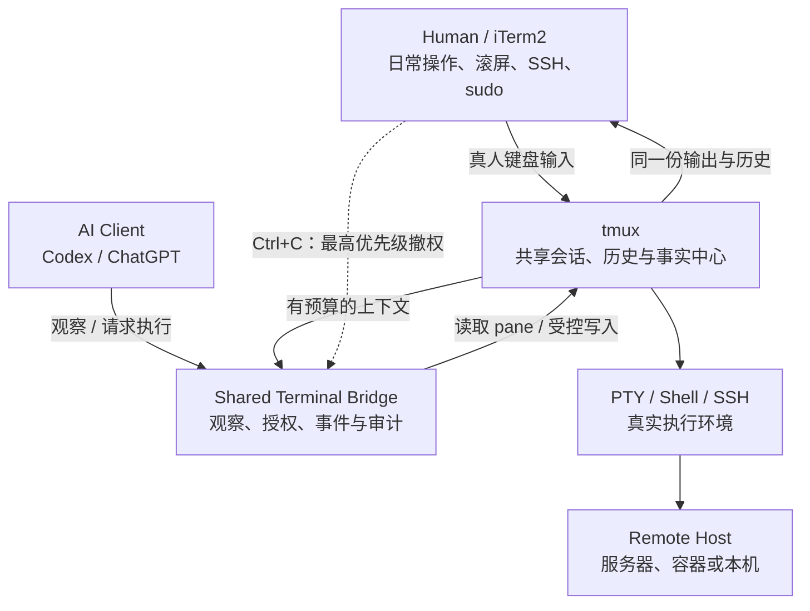

# Shared Terminal Bridge（一）：为什么不重新开发一个 AI Terminal

> **系列导航**：[系列目录](../README.md) · 下一篇：[Shared Terminal Bridge（二）：Ctrl+C 不是命令失败，而是人类撤权](02-human-ctrl-c.md)
> **系列定位**：本文是《Shared Terminal Bridge：人与 AI 共用真实终端的演进记录》第 1 篇。它回答最初的问题：为什么不重新开发一个 AI Terminal，而是让人和 AI 共用现有的 iTerm2、tmux 与 Shell。

## 问题不是“给 AI 一个终端”

最初的需求非常朴素：人在 iTerm2 中完成 SSH、查看日志、运行命令和处理交互程序；当遇到报错或复杂状态时，希望直接问 Codex“刚才为什么失败”“接下来怎么处理”，而不是手工复制几百行输出到对话框里。
如果只把这个问题理解成“给 AI 一个 Shell”，最容易得到两套互相分离的环境：

- 人在自己的 Terminal 中操作一套 SSH 和 Shell；
- AI 在后台启动另一套 Shell、PTY 或远程连接；
- 双方看到的 cwd、环境变量、sudo 状态、前台进程和历史并不一致；
- 人想介入时，不知道 AI 真正控制的是哪一个会话。
Shared Terminal Bridge 的起点因此不是“怎样造一个更智能的 Terminal”，而是：

> **怎样让人和 AI 面对同一个真实 Shell，同时让人的操作权始终高于模型。**

## 为什么不重新开发 AI Terminal

重新包装一个 Web Terminal 或专用 AI Terminal，表面上能把聊天、终端和工具放进同一界面，但它会同时引入几个新问题。

### 1. 人已经有成熟的终端工作流

iTerm2 已经提供窗口、Tab、Split、选择复制、滚动搜索、快捷键和长期形成的操作习惯。重新实现这些能力成本很高，也很难达到原生 Terminal 的稳定性。
项目真正需要的是让 AI 读懂和协作，而不是替换人的主界面。

### 2. Shell 状态不能复制

真实运维上下文不只是屏幕上的几行文字，还包括：

- 当前 SSH 连接；
- cwd、环境变量和 shell state；
- 已经取得的 sudo 权限；
- 前台进程和 TTY 状态；
- 交互程序当前所在页面；
- 长时间运行命令及其历史输出。
如果 AI 另起一个 Shell，它得到的只是“相似环境”，不是人正在使用的那个环境。

### 3. 人工接管必须立即生效

共享终端中最重要的能力不是自动执行，而是人能随时按下 Ctrl+C、输入命令或接管 TUI。这个控制权不能依赖模型是否正确理解了一段输出，也不能等待模型下一次轮询。

### 4. 事实中心应该在模型之外

模型会换，会话会结束，MCP 或远程连接方式也会变化。真正的 Shell、执行状态和历史不能依赖某一个 AI 会话继续存在。
因此系统把 tmux 中的真实 session 定义为事实中心，而不是把 Codex 或 ChatGPT 当作状态中心。

## 最初形成的系统边界

系统最终采用下面的分层：




[Mermaid 源文件](https://github.com/sharpbai/notion-assets/blob/main/tech/shared-terminal-bridge/01-why-not-ai-terminal-architecture.mmd) · [SVG 版本](https://raw.githubusercontent.com/sharpbai/notion-assets/main/tech/shared-terminal-bridge/01-why-not-ai-terminal-architecture.svg) · [PNG 版本](https://raw.githubusercontent.com/sharpbai/notion-assets/main/tech/shared-terminal-bridge/01-why-not-ai-terminal-architecture.png)

<table fit-page-width="true" header-row="true">
<tr>
<td>层次</td>
<td>职责</td>
<td>不负责什么</td>
</tr>
<tr>
<td>iTerm2</td>
<td>人的主操作界面</td>
<td>不承担 AI 协议和安全状态</td>
</tr>
<tr>
<td>tmux</td>
<td>持久 session、pane、历史和共享事实中心</td>
<td>不做模型推理</td>
</tr>
<tr>
<td>Shared Terminal Bridge</td>
<td>观察、事件、授权、受控写入和审计</td>
<td>不替代 Shell，不隐藏执行内容</td>
</tr>
<tr>
<td>Codex / ChatGPT</td>
<td>理解任务、分析结果和决定下一步</td>
<td>不拥有终端事实，不绕过本地安全边界</td>
</tr>
<tr>
<td>PTY / Shell / SSH</td>
<td>实际执行环境</td>
<td>不需要理解 AI 或 Bridge 协议</td>
</tr>
</table>

## tmux 为什么成为关键

早期曾考虑从 iTerm2 Python API、窗口焦点或 macOS 全局键盘事件切入。这些方式要么会弹出额外窗口，要么监听范围过大，要么把方案绑定到特定 Terminal 模拟器。
真正稳定的交汇点是 tmux：

- 人的键盘输入通过 tmux client 到达 pane；
- AI 的输入可以通过 Bridge 受控地发送到同一个 pane；
- pane history 同时服务于人类滚屏和 AI 观察；
- iTerm2 关闭后，Shell 与 SSH session 仍可保留；
- Terminal 模拟器以后可以替换，而共享会话不需要变化。
这形成了项目最早也最重要的判断：

> **不要盯着 iTerm2，实际操作对象是 tmux。**

## 人与 AI 的正常协作方式

### 默认观察模式

```text
Human 操作同一个 Shell
→ tmux 保存输入输出
→ AI 按需读取有预算的上下文
→ AI 分析并给出建议
→ Human 决定是否继续

```

观察不应该要求写权限。AI 只是想查看历史时，不应因为另一个任务持有执行权而被阻止，也不应为了“看一眼”去申请 lease。

### 明确授权后的执行模式

```text
Human 明确要求 AI 执行
→ AI 读取当前 pane 与状态
→ 本地 Bridge 授予当前回合的执行权
→ 命令以可见文本进入同一个 Shell
→ 输出继续留在同一个 tmux pane
→ AI 读取结果并决定是否需要下一步

```

这里没有“人的终端”和“AI 的终端”两套状态。双方共享的是同一个前台进程、同一份历史以及同一个 SSH 上下文。

### 人工接管模式

人在任何时候都可以直接操作 Terminal。尤其是 Ctrl+C，它不应该被理解为普通退出码或“换一种方法继续”的信号，而是最高优先级的人工接管。
这一点后来进一步演化成 HumanEventLayer 和 Execution Lease：

```text
Ctrl+C ≠ command failed
Ctrl+C ≠ automatic retry
Ctrl+C ≠ continue next step

Ctrl+C = Human Override

```

后续文章会单独解释，怎样在 tmux 层可靠区分真人 Ctrl+C 与 Agent 发送的 Ctrl+C，以及怎样让已经做出的旧模型决策在到达终端前失效。

## 这套设计刻意不做什么

第一阶段没有开发 Web Terminal，也没有试图统一所有终端 UI，更没有要求目标服务器安装 Agent wrapper。
它刻意保持以下边界：

- 不替换 iTerm2；
- 不让模型拥有独立的隐藏 Shell；
- 不要求用户复制终端输出；
- 不在目标环境注入脚本、marker 或控制文件；
- 不假设远端存在特定 shell、Python 或临时目录；
- 不把安全建立在提示词和模型自觉之上；
- 不把完整 scrollback 每轮都塞进模型上下文。
这使得后续无论接入 Codex 本地 MCP，还是通过 RDC 接入 ChatGPT，核心终端模型都可以保留。

## 第一阶段得到的结论

Shared Terminal Bridge 最初解决的并不是自动化能力，而是系统边界：

1. **人保留原来的 Terminal 和操作习惯。**
2. **tmux 是双方共享的事实中心。**
3. **AI 默认观察，写入必须经过授权。**
4. **命令必须在人面前可见。**
5. **人工介入优先于模型已有计划。**
6. **Bridge 只负责本地控制与状态，不负责复杂推理。**
7. **AI 客户端和传输方式可以替换，真实终端不随之迁移。**
这套边界确定以后，项目才进入真正困难的下一步：如何可靠判断 Ctrl+C 究竟来自真人还是 Agent，并把它变成一个结构化、不会丢失的 Human Override 事件。

---

## 下一篇

**《Shared Terminal Bridge（二）：Ctrl+C 不是命令失败，而是人类撤权》**
下一篇将记录从 iTerm2 Python API、全局监听和屏幕变化判断，到最终使用 tmux root key table 区分 Human/Agent 输入来源的完整过程。

## 历史资料

本系列重新建立独立文章，以下早期文档保持原样，作为设计与迭代历史保留：

- [人与 Codex 共用终端的交互式运维架构260920](../references/interactive-ops-architecture-260920.md)
- [Shared Terminal Bridge 迭代史：从 Ctrl+C PoC 到 API v9](../references/stb-iteration-history-api-v9.md)
- [Shared Terminal Bridge：人与 Codex 共用 tmux 的交互式运维架构与实测](../references/stb-codex-tmux-architecture-and-validation.md)
- [STB-RDC：ChatGPT 共享终端适配层 v0.1 及验收260922](../references/stb-rdc-v0.1-acceptance-260922.md)
