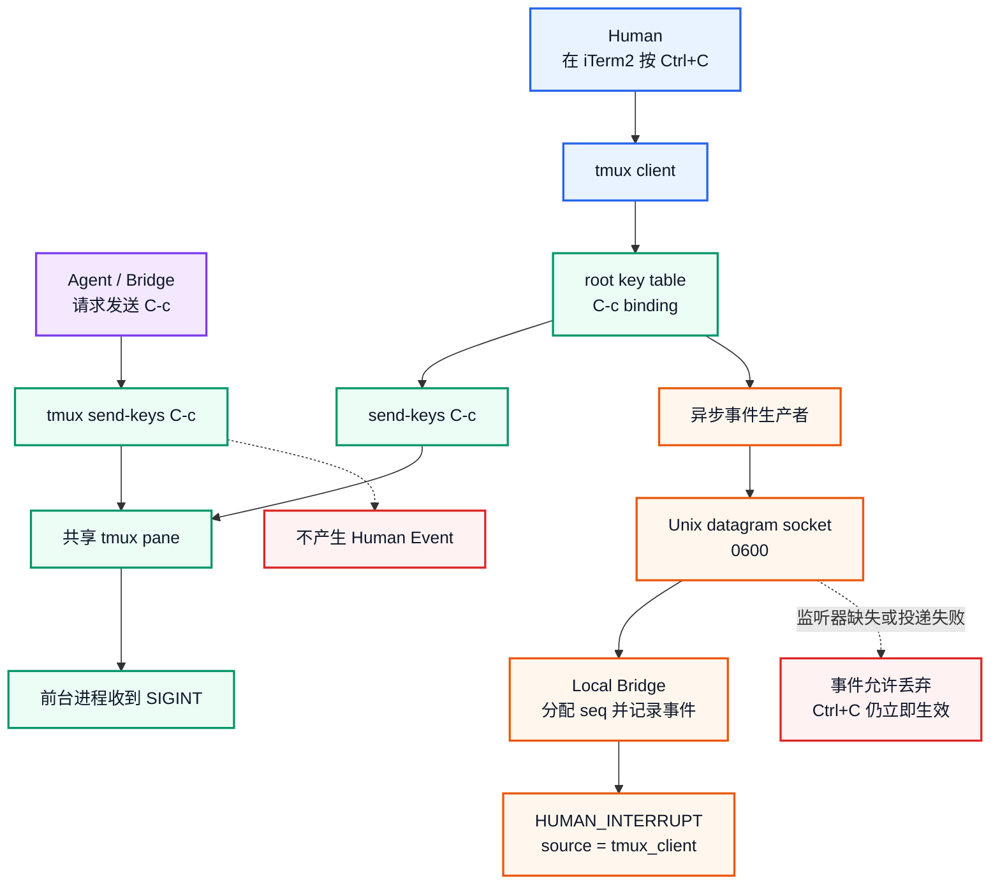

# Shared Terminal Bridge（二）：Ctrl+C 不是命令失败，而是人类撤权

> **系列导航**：[系列目录](../README.md) · 上一篇：[Shared Terminal Bridge（一）：为什么不重新开发一个 AI Terminal](01-why-not-ai-terminal.md) · 下一篇：[Shared Terminal Bridge（三）：Execution Lease 与 Generation 如何阻止过期的 AI 决策](03-execution-lease-generation.md)
> **系列定位**：本文是《Shared Terminal Bridge：人与 AI 共用真实终端的演进记录》第 2 篇。上一篇确定 tmux 是共享事实中心；这一篇解决更基础的问题：同一个 pane 中出现 Ctrl+C 时，怎样可靠知道它是人亲自按下的，而不是 Agent 注入或程序自己退出。

## Ctrl+C 为什么不能只当作一个字符

在普通 Shell 中，Ctrl+C 最终通常表现为前台进程收到 SIGINT、终端出现 `^C`，然后返回 prompt。对只读取屏幕历史的模型来说，几种完全不同的情况可能长得很像：

- 人主动按下 Ctrl+C，要求停止当前任务；
- Agent 自己发送 Ctrl+C，结束一个命令；
- 程序捕获信号后主动退出；
- SSH、PTY 或前台进程异常终止；
- 屏幕中只是输出了一段包含 `^C` 的文本。
因此，仅凭 `capture-pane` 看到 `^C` 或新的 prompt，最多只能推测“发生过中断”，不能可靠回答最重要的问题：

> **这是不是人主动夺回控制权？**
而对共享终端来说，来源比字符本身更重要。Agent 发出的 Ctrl+C 可以是当前执行策略的一部分；真人 Ctrl+C 则意味着当前自动推进链应该立即停止。

## 最初尝试：从 iTerm2 捕获按键

第一版 PoC 使用 iTerm2 Python API 的 `KeystrokeMonitor`。
在普通 shell 中，它确实可以读到：

```text
chars = '\x03'
modifier = CONTROL
keycode = ANSI_C

```

但进入普通 tmux 后，monitor 不再稳定收到 pane 中的后续输入。这暴露了一个层次错误：iTerm2 看到的是 Terminal 模拟器和会话窗口，而真正承载共享 Shell、历史和前台进程的是 tmux。
此外，全局键盘监听还有更严重的问题：

- 监听范围超出目标共享会话；
- 可能接触密码、Token 和其他敏感输入；
- 很难只约束到某个 tmux pane；
- 方案与 iTerm2/macOS 强绑定；
- 新窗口、焦点和 Control Mode 会引入额外状态。
因此项目放弃了“监听整台机器的键盘”，把来源识别边界下移到 tmux client input layer。

## 关键突破：Human 与 Agent 走不同路径

真人键盘输入和程序化 `tmux send-keys` 虽然最终都会进入同一个 pane，但它们在进入 pane 前经过的路径不同：

- 真人按键经过 **tmux client → key table**；
- Agent 的 `tmux send-keys` 直接把按键送入 pane，不经过 client key table。
这意味着可以在 tmux 的 `root` key table 上绑定 `C-c`：

```javascript
bind-key -T root C-c \
  send-keys C-c \; \
  run-shell -b 'publish HUMAN_INTERRUPT'

```

这个 binding 同时完成两件事：

1. 先把 `C-c` 原样送给前台程序，保持正常 SIGINT 行为；
2. 异步发布一条带来源、pane 和 client 的 Human Event。
Agent 调用 `tmux send-keys C-c` 时不会命中这个 binding，所以可以停止前台进程，却不会产生 Human Event。

## 完整来源分流




[Mermaid 源文件](https://github.com/sharpbai/notion-assets/blob/main/tech/shared-terminal-bridge/02-human-agent-ctrl-c-split.mmd) · [SVG 版本](https://raw.githubusercontent.com/sharpbai/notion-assets/main/tech/shared-terminal-bridge/02-human-agent-ctrl-c-split.svg) · [PNG 版本](https://raw.githubusercontent.com/sharpbai/notion-assets/main/tech/shared-terminal-bridge/02-human-agent-ctrl-c-split.png)

<table fit-page-width="true" header-row="true">
<tr>
<td>输入来源</td>
<td>pane 收到 C-c</td>
<td>产生 HUMAN_INTERRUPT</td>
</tr>
<tr>
<td>Human，经 tmux client</td>
<td>是</td>
<td>是</td>
</tr>
<tr>
<td>Agent，经 tmux send-keys</td>
<td>是</td>
<td>否</td>
</tr>
</table>
这不是根据屏幕内容进行分类，而是在按键进入 pane 之前，根据真实输入路径完成归因。

## 第一次隔离 PoC

验证使用独立 tmux socket 和 session，避免影响日常环境：

```text
socket  = human-event-poc
session = human-event-poc
log     = /tmp/tmux-human-events.log

```

测试步骤：

1. 在隔离 pane 中运行 `ping 1.1.1.1`；
2. 人亲自在 tmux client 中按 Ctrl+C；
3. 前台 `ping` 正常停止；
4. 日志新增一条 Human 事件；
5. 再由脚本执行 `tmux send-keys C-c`；
6. 前台同样收到中断，但 Human 事件数量不增加。
真人操作得到：

```text
2026-09-20T11:08:31+0800 HUMAN_INTERRUPT pane=%0 client=/dev/ttys021

```

Agent 注入测试之后，事件日志仍然只有原来的这一条。
这个结果证明了最核心的假设：

> **同一个按键、同一个 pane、同样能停止前台程序，但来源可以在 tmux 输入层可靠分流。**

## 从文本日志到结构化事件

文件日志足以证明来源分流，但不能支撑后续 Bridge 实时响应。因此第二个 PoC 将事件发送到本地 Unix datagram socket：

```text
Human Ctrl+C
→ tmux root binding
→ send-keys C-c
→ 前台进程立即收到 SIGINT
→ 异步短进程发送 datagram
→ Local Bridge 接收并分配单调 seq

```

实际收到的事件类似：

```json
{
  "client": "/dev/ttys021",
  "key": "C-c",
  "pane": "%0",
  "seq": 1,
  "session": "human-event-socket-poc",
  "source": "tmux_client",
  "timestamp": "2026-09-20T11:22:27.611+08:00",
  "type": "human_interrupt"
}

```

这条结构化事件提供了后续控制链需要的核心字段：

- `type`：事件语义；
- `source`：真实来源；
- `session/pane`：作用范围；
- `client`：具体 tmux client/TTY；
- `seq`：本地有序事件编号；
- `timestamp`：审计与关联时间。
Socket 权限设置为 `0600`，只允许当前用户访问。

## 最重要的故障原则：Ctrl+C 必须 fail-open

Human Event 是附加控制信号，不能反过来成为真人操作的依赖。
因此 tmux binding 的顺序必须是：

```text
先 send-keys C-c
→ 再异步发布事件

```

而不是：

```text
先等待 Bridge 确认
→ 再允许 Ctrl+C

```

实测中，即使 Unix Socket listener 完全没有运行，真人 Ctrl+C 仍然立即停止前台 `ping`。事件可以丢失，人工控制不能失效。
这条原则贯穿后来的完整实现：

- Bridge 崩溃不能阻止人使用 tmux；
- event socket 不存在不能阻止 SIGINT；
- 日志失败不能延迟按键；
- 模型或 MCP 不在线时，人仍然拥有完整终端。

## HumanEventLayer 提供的不是键盘记录

项目没有记录普通人类按键，也没有试图还原所有输入内容。HumanEventLayer 只捕获极少数具有控制语义的事件，最重要的是 Ctrl+C。
这样可以同时满足：

- 不扩大密码和敏感输入暴露面；
- 不建立全局键盘监听；
- 将事件精确限制到 tmux client、session 和 pane；
- 保留人类自然使用 Terminal 的体验；
- 给 Bridge 一个可信的 Human Override 控制通道。
数据通道与控制通道由此分离：

```text
数据通道：tmux pane history / output
控制通道：Human Event

```

history 回答“终端里发生了什么”，Human Event 回答“人刚刚做了什么”。

## 为什么说 Ctrl+C 是“人类撤权”

到这一阶段，HumanEventLayer 已经能可靠发出 `HUMAN_INTERRUPT`，但它本身还没有阻止 Agent 的下一次写入。
如果模型已经在事件发生前决定了下一条命令，单纯通知模型“人按了 Ctrl+C”仍然存在竞态：旧动作可能已经排队，并在事件之后到达 pane。
因此 `HUMAN_INTERRUPT` 的最终语义不是普通观测信息，而应该驱动本地授权状态变化：

```text
Human Ctrl+C
→ HUMAN_INTERRUPT
→ 当前执行权限失效
→ 旧的 Agent 决策不得再进入 pane

```

这正是下一阶段 Execution Lease 与 generation 要解决的问题。HumanEventLayer 负责可信地识别“是谁按的”，Execution Lease 负责让这次人工接管在本地强制生效。

## 这一阶段得到的结论

1. 不能从屏幕内容可靠判断 Ctrl+C 来源。
2. 全局键盘监听超出最小权限边界。
3. iTerm2 不是稳定的事件控制面，tmux client 才是。
4. 真人输入与 `tmux send-keys` 在 client key table 之前存在天然分界。
5. Human Ctrl+C 必须同时送达前台进程并产生结构化事件。
6. 事件传输必须 fail-open，不能阻塞人工中断。
7. HumanEventLayer 只记录控制事件，不记录普通按键和敏感输入。
8. `HUMAN_INTERRUPT` 必须进一步关联本地执行授权，才能消除旧模型决策的竞态。

---

## 系列导航

上一篇：[Shared Terminal Bridge（一）：为什么不重新开发一个 AI Terminal](01-why-not-ai-terminal.md)
下一篇：**《Shared Terminal Bridge（三）：Execution Lease 与 Generation 如何阻止过期的 AI 决策》**

## 历史资料

本系列使用以下验证记录作为历史依据，原文继续保留：

- [Notion 页面](https://app.notion.com/p/3e147b2dd1458175b152cfd6e8daf43f)
- [Notion 页面](https://app.notion.com/p/3e247b2dd14581589c65d3c6db70a317)
