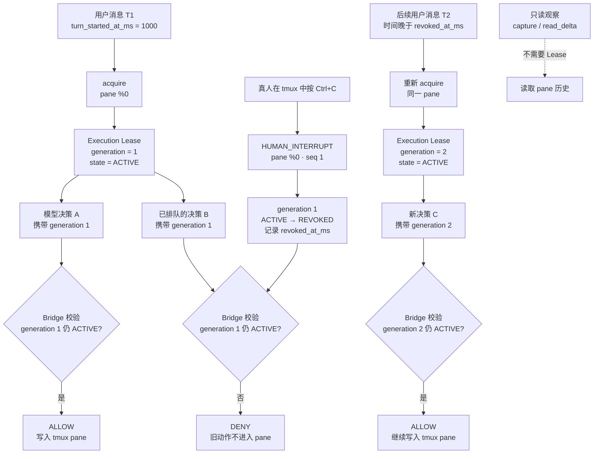

# Shared Terminal Bridge（三）：Execution Lease 与 Generation 如何阻止过期的 AI 决策

> **系列导航**：[系列目录](../README.md) · 上一篇：[Shared Terminal Bridge（二）：Ctrl+C 不是命令失败，而是人类撤权](02-human-ctrl-c.md) · 下一篇：[Shared Terminal Bridge（四）：从本地 PoC 到 Codex 可调用的安全终端服务](04-local-poc-to-codex.md)
> **系列定位**：本文是《Shared Terminal Bridge：人与 AI 共用真实终端的演进记录》第 3 篇。上一篇已经能在 tmux 输入层可信地区分真人与 Agent 的 Ctrl+C；这一篇继续解决更危险的竞态：人已经中断，但模型先前决定的下一条动作仍在路上，怎样保证它绝不进入终端。

## 真正的问题不是“让模型知道”，而是“让旧决定失效”

假设 Agent 正在一个共享 pane 中执行排查：

1. 模型决定先运行命令 A，再运行命令 B；
2. 命令 A 执行时间很长；
3. 人发现方向不对，按下 Ctrl+C；
4. `HUMAN_INTERRUPT` 被 Bridge 收到；
5. 但命令 B 已经由上一次模型决策生成，正在工具调用或队列中。
如果系统只是把“人按了 Ctrl+C”作为一条消息通知模型，就存在时间窗口：旧动作 B 可能在模型看到通知之前进入 pane。提示词里的“看到 Ctrl+C 后请停止”只能约束下一次推理，不能撤销已经生成的工具调用。
所以 Shared Terminal Bridge 需要一个位于模型之外、本地强制执行的规则：

> **任何写入动作在抵达 tmux 前，都必须证明自己仍持有当前有效的执行权限。**
这份短期、可撤销、与 pane 绑定的权限，就是 Execution Lease。

## Execution Lease 是什么

Execution Lease 可以理解为 Bridge 签发的一张一次执行阶段的通行证。最小状态包括：

```json
{
  "pane": "%0",
  "generation": 1,
  "state": "ACTIVE",
  "thread_id": "codex-thread-id",
  "turn_id": "user-turn-id",
  "turn_started_at_ms": 1789875000000
}

```

每一次会改变终端的动作都必须携带 `pane` 和 `generation`。Bridge 在发送字节之前检查：

- Lease 是否属于这个 pane；
- generation 是否等于当前 generation；
- 状态是否仍为 `ACTIVE`；
- 调用是否来自获得授权的任务与用户轮次。
只要有一项不成立，Bridge 就拒绝写入，tmux pane 不会看到任何字节。
这与“模型承诺不继续”有本质区别：模型可以犯错、重试、超时或收到延迟响应，但最终写入点只有 Bridge，而 Bridge 不接受失效的凭证。

## 为什么不能只用一个 authorized 布尔值

如果授权只有 `true/false`，就会出现 ABA 问题：

```text
true  → 人工撤销 → false → 后续用户重新授权 → true

```

一个很早以前拿到 `true` 的旧动作，无法区分“原来的 true”和“后来重新授权产生的 true”。
generation 把每一轮授权变成不可混淆的版本：

```text
generation 1: ACTIVE → REVOKED
generation 2: ACTIVE

```

即使系统后来重新授权，携带 generation 1 的动作仍然永久过期。新授权不会复活旧决策。

## 从撤权到重新授权的完整时序




[Mermaid 源文件](https://github.com/sharpbai/notion-assets/blob/main/tech/shared-terminal-bridge/03-execution-lease-generation.mmd) · [SVG 版本](https://raw.githubusercontent.com/sharpbai/notion-assets/main/tech/shared-terminal-bridge/03-execution-lease-generation.svg) · [PNG 版本](https://raw.githubusercontent.com/sharpbai/notion-assets/main/tech/shared-terminal-bridge/03-execution-lease-generation.png)

## 本地 PoC 怎样证明它真的生效

验证从 generation 1、`ACTIVE` 状态开始。首先由 Agent 发送 Ctrl+C：

```text
AGENT_KEY pane=%0 generation=1 key=C-c state=ACTIVE

```

前台进程被停止，但因为它没有经过 tmux client 的真人按键路径，所以不会产生 Human Event，Lease 继续保持 `ACTIVE`。
随后用 generation 1 发送一个正常动作：

```text
LEASE_GEN_1_ACTION_ALLOWED

```

pane 中能看到该文本，审计记录为：

```text
ALLOW pane=%0 generation=1 bytes=37

```

接着人在运行 `ping` 时亲自按 Ctrl+C。Bridge 收到：

```json
{
  "client": "/dev/ttys021",
  "key": "C-c",
  "pane": "%0",
  "seq": 1,
  "session": "execution-lease-poc",
  "source": "tmux_client",
  "type": "human_interrupt"
}

```

Lease 立即从 `ACTIVE` 变为 `REVOKED`：

```text
OVERRIDE pane=%0 generation=1 previous=ACTIVE state=REVOKED event_seq=1

```

PoC 再模拟一个已经持有 generation 1 的旧动作。Bridge 在写入前拒绝：

```text
DENY pane=%0 generation=1 lease_generation=1 state=REVOKED

```

最重要的验收不是日志里出现 `DENY`，而是旧动作的标记文本完全没有出现在 pane 中。这证明撤权发生在本地写入边界，而不是依赖模型事后自律。

## Human Ctrl+C 撤销的是哪一部分

真人 Ctrl+C 撤销的是**当前 generation 的写权限**，不是永久禁止 Codex，也不是把 tmux 变成不可访问状态。

<table fit-page-width="true" header-row="true">
<tr>
<td>能力</td>
<td>撤权后</td>
<td>原因</td>
</tr>
<tr>
<td>读取 pane 历史、增量和状态</td>
<td>允许</td>
<td>观察不会改变执行环境，Agent 应立即收集现场并返回</td>
</tr>
<tr>
<td>携带旧 generation 写入</td>
<td>拒绝</td>
<td>属于被人终止的旧决策链</td>
</tr>
<tr>
<td>同一用户轮次重新 acquire</td>
<td>拒绝</td>
<td>否则 Agent 可以自动绕过人工撤权</td>
</tr>
<tr>
<td>更晚的新用户消息重新 acquire</td>
<td>允许</td>
<td>新消息代表人重新授予继续操作的权限</td>
</tr>
</table>
因此理想行为是：人按 Ctrl+C 后，当前自动执行链立即终止；Agent 仍可读取刚才的输出、解释发生了什么并返回。用户随后明确要求继续时，才进入新的授权 generation。

## 怎样可靠判断“这是后续用户消息”

MCP 调用本身没有提供一个可完全信任的 Codex turn ID。如果只靠工具说明要求模型传入“这是新一轮”，模型可能误用旧标识，Bridge 也无法区分重试与真实的新消息。
STB 因此把授权身份扩展为：

```text
(thread_id, turn_id, turn_started_at_ms)

```

其中：

- `thread_id` 标识 Codex 任务；
- `turn_id` 标识一次用户消息触发的工作轮次；
- `turn_started_at_ms` 使用单调递增语义的 Unix 毫秒时间进行先后比较。
Human Override 发生时，Bridge 记录 `revoked_at_ms`。重新 acquire 必须同时满足：

```text
new_turn_id != revoked_turn_id
and new_turn_started_at_ms > revoked_at_ms

```

这样，同一轮中的重试、工具恢复或延迟调用都不能自行复权；只有时间上确实发生在撤权之后的新用户消息，才能获得新的 generation。
时间戳不是用来替代全部身份校验，而是给本地服务一个可以强制执行的先后关系。generation 仍然负责隔离每次授权，thread 和 turn 则负责说明授权来自谁、属于哪一轮。

## Lease 为什么要绑定 pane，而不是整个 tmux

一个 tmux server 里可能有多个 session 和 pane。人只在 `%5` 中按 Ctrl+C，不应该撤销另一个 pane 的工作。因此 Lease 的最小作用域是 pane：

```text
pane %5, generation 8, ACTIVE

```

写入动作必须同时匹配 pane identity 与 generation。更完整的实现还会记录 tmux server identity，避免 daemon 重启、server 重建或 pane ID 被复用后，旧 Lease 意外落到一个新 pane 上。
这也解释了为什么 STB 把观察和执行分开：多个任务可以只读同一个 pane 的历史，但同一时刻只有持有有效 Lease 的调用可以写入。

## RELEASED 与 REVOKED 不是一回事

Lease 的几个核心状态分别表达不同语义：

- `ACTIVE`：当前 generation 可以执行写操作；
- `RELEASED`：Agent 正常完成或主动归还权限；
- `REVOKED`：真人通过 Human Override 强制终止当前执行链。
两者都不再允许写入，但审计语义不同。`RELEASED` 表示一次正常结束；`REVOKED` 表示必须保留的人类接管事实，并对同一轮重新授权施加更严格限制。

## 崩溃恢复必须默认失效

Execution Lease 属于临时能力，不能因为本地 daemon 重启而自动恢复。安全策略是：

- daemon 启动后，旧的 `ACTIVE` Lease 统一视为已撤销；
- generation 继续单调增长，不能退回旧编号；
- tmux server identity 变化时，旧 pane 绑定失效；
- Agent 必须在新的用户轮次中重新 acquire。
这是一种 fail-closed 的写入策略。它与上一篇 Human Event 的 fail-open 原则并不冲突：

- 人的 Ctrl+C 必须 fail-open，Bridge 坏了也要能立即中断；
- Agent 的写权限必须 fail-closed，状态不确定时不允许写入。
两条原则共同保证“人永远能停，AI 不能在不确定时继续”。

## Execution Lease 的边界

Execution Lease 不负责判断命令是否危险，也不等同于 sudo、RBAC 或完整策略引擎。它解决的是一个更窄但关键的问题：

> **某个模型动作在此刻是否仍然拥有向这个 pane 写入的时序权限。**
命令审批、长任务确认、敏感操作策略和目标主机权限仍需要更上层机制处理。Lease 是这些能力生效前的最后一道本地时序门禁。

## 这一阶段得到的结论

1. Human Event 只通知模型还不够，旧工具调用可能已经在路上。
2. 所有写入必须在进入 tmux 前由本地 Bridge 校验。
3. generation 让重新授权不会复活旧动作，避免 ABA 问题。
4. Human Ctrl+C 将当前 generation 从 `ACTIVE` 变为 `REVOKED`。
5. 撤权后仍允许只读观察，以便立刻收集现场并向人返回。
6. 同一用户轮次不能自行重新 acquire；更晚的新用户消息可以获得新 generation。
7. Lease 必须按 pane 作用域绑定，并结合 server identity 防止 ID 复用。
8. 人工中断 fail-open，Agent 写入 fail-closed。

---

## 系列导航

上一篇：[Shared Terminal Bridge（二）：Ctrl+C 不是命令失败，而是人类撤权](02-human-ctrl-c.md)
下一篇：**《Shared Terminal Bridge（四）：从本地 PoC 到 Codex 可调用的安全终端服务》**

## 历史资料

本系列使用以下验证记录作为历史依据，原文继续保留：

- [人与 Codex 共用终端的交互式运维架构260920](../references/interactive-ops-architecture-260920.md)
- [Shared Terminal Bridge 迭代史：从 Ctrl+C PoC 到 API v9](../references/stb-iteration-history-api-v9.md)
