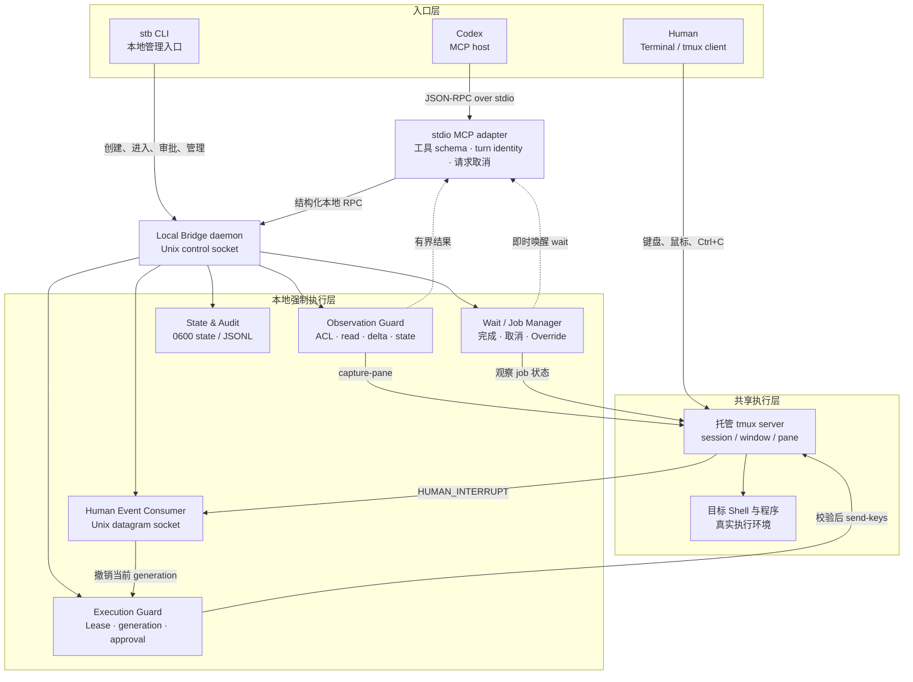

# Shared Terminal Bridge（四）：从本地 PoC 到 Codex 可调用的安全终端服务

> **系列导航**：[系列目录](../README.md) · 上一篇：[Shared Terminal Bridge（三）：Execution Lease 与 Generation 如何阻止过期的 AI 决策](03-execution-lease-generation.md) · 下一篇：[Shared Terminal Bridge（五）：AI Context Policy 与 Task Block 如何降低终端 Token 消耗](05-ai-context-policy-task-block.md)
> **系列定位**：本文是《Shared Terminal Bridge：人与 AI 共用真实终端的演进记录》第 4 篇。前三篇分别确定了 tmux 共享事实中心、真人 Ctrl+C 来源识别和 Execution Lease 撤权机制；这一篇讲它们怎样从几个独立 PoC 合并成常驻本地服务，并以最小 MCP 接口安全地交给 Codex 使用。

## PoC 证明机制，服务化解决日常使用

早期验证脚本各自回答一个问题：

- 能否在 tmux 输入层区分 Human 与 Agent 的 Ctrl+C；
- 能否把 Human Event 通过 Unix socket 实时送出；
- 能否按 pane 读取历史，同时隔离未授权 pane；
- 能否用 Execution Lease 拒绝已经过期的写入；
- 能否精确解析某个 tmux client 当前所在的 pane。
这些 PoC 证明了关键假设，却还不是一个可以长期使用的系统。每个脚本都有自己的状态和生命周期，单独启动、单独创建 tmux socket，也无法让 Codex 在一次任务中稳定完成“观察—执行—等待—中断—继续”。
因此下一步不是继续堆脚本，而是把已验证的控制点合并到一个保持状态的 Local Bridge daemon 中。

## 为什么 Bridge 必须是常驻本地 daemon

Execution Lease、generation、Human Event 序号和 tmux binding 快照都跨越单次工具调用。如果每次 MCP 调用临时启动一个进程，就会出现：

- 不同调用看不到同一份 Lease；
- generation 可能退回或重复；
- Human Ctrl+C 到达时没有持续监听者；
- 等待中的 job 与取消事件无处关联；
- tmux binding 无法安全备份和恢复；
- 审计记录分散，无法重建发生过什么。
常驻 daemon 成为唯一的本地状态所有者。它对上提供 Unix control socket，对 tmux 管理观察、授权和动作，对 Human Event socket 持续监听，并将必要状态与审计以 `0600` 权限持久化。
这也形成清晰的信任边界：MCP adapter 可以重启、升级或被 Codex 重新拉起，但它不能绕过 Bridge 直接操作 tmux。

## 完整本地架构




[Mermaid 源文件](https://github.com/sharpbai/notion-assets/blob/main/tech/shared-terminal-bridge/04-local-bridge-mcp-architecture.mmd) · [SVG 版本](https://raw.githubusercontent.com/sharpbai/notion-assets/main/tech/shared-terminal-bridge/04-local-bridge-mcp-architecture.svg) · [PNG 版本](https://raw.githubusercontent.com/sharpbai/notion-assets/main/tech/shared-terminal-bridge/04-local-bridge-mcp-architecture.png)

## 合并时贯通的四个核心模块

第一个 combined Bridge 原型把四个此前独立的模块放进同一进程：

1. **Observation API**：列出授权范围、读取 pane history 和前台状态；
2. **Per-client active pane resolution**：知道特定 tmux client 当前真正指向哪个 pane；
3. **Human Event consumer**：从 Unix datagram socket 接收结构化真人事件；
4. **Execution Lease 与 Action Guard**：每次写入前检查 pane、generation 和状态。
端到端链路变为：

```text
client identity
→ exact pane
→ ACL
→ observation
→ execution lease
→ guarded action
→ Human event
→ lease revoked
→ stale action denied

```

自动验收同时确认：未授权 pane 内容不会泄漏；有效 generation 的文本能到达 pane；Agent Ctrl+C 不撤权；Human Ctrl+C 会撤权；旧 generation 返回 `EXECUTION_LEASE_INVALID`，对应文本不会出现在 pane history。

## MCP 只做适配，不成为新的安全边界

Codex 通过 MCP 调用工具，但 MCP server 并不直接运行 `tmux` 命令。它只是一个 stdio adapter：

```text
Codex
→ JSON-RPC over stdio
→ MCP adapter
→ Unix socket RPC
→ Local Bridge
→ tmux

```

这个结构有几个重要结果：

- 工具参数校验与 MCP 协议细节留在 adapter；
- ACL、Lease、generation、Human Override 始终由 daemon 强制；
- Bridge socket 不可达时返回 `BRIDGE_UNAVAILABLE`，不会降级成直接调用 tmux；
- adapter 的 stdout 只承载 MCP framing，日志不能污染协议；
- 不同 Codex 任务可以各自拥有 MCP 进程，但共享同一个本地安全状态。
换句话说，MCP 是 Codex 的接口层，不是授权事实来源。

## 为什么最小 MCP 默认只有只读工具

最初的 MCP 工具目录默认只注册 Observation：

```text
terminal_list
get_active_pane
terminal_read
terminal_read_delta
terminal_wait_delta
terminal_state

```

这些能力不能改变 pane，仍然受 Bridge 的 pane ACL 约束。只有 MCP server 以 `--enable-actions` 显式启动时，才发布输入、提交、按键、中断、任务块和等待等 Action 工具。
这种分层避免了“连接上 MCP 就天然拥有终端写权限”。工具发现、能否观察、能否申请执行、某次写入是否仍有效，是四件不同的事。

<table fit-page-width="true" header-row="true">
<tr>
<td>层次</td>
<td>回答的问题</td>
<td>主要约束</td>
</tr>
<tr>
<td>Tool discovery</td>
<td>Codex 是否看见这个能力</td>
<td>MCP 启动参数与版本协商</td>
</tr>
<tr>
<td>Observation</td>
<td>能否读取这个 pane</td>
<td>Pane ACL、内容预算</td>
</tr>
<tr>
<td>Acquire</td>
<td>当前用户轮次能否取得写权限</td>
<td>thread、turn、generation</td>
</tr>
<tr>
<td>Action</td>
<td>这一次写入此刻还能否执行</td>
<td>写入前 Lease 校验</td>
</tr>
</table>

## 工具不是越少越好，而是语义要原子化

早期写命令可能需要两次调用：先 `terminal_type`，再 `terminal_key Enter`。这既增加往返，也容易在引号、换行和取消时留下半条命令。
后来加入 `terminal_submit`，在一次 Bridge 请求内完成 literal text 输入与 Enter，并返回 `job_id`。它不是把权限放宽，而是把一个本来不可分割的用户意图变成原子操作：

```text
校验 Lease
→ 输入完整命令
→ Enter
→ 建立 job
→ 返回 job_id

```

底层的 `terminal_type` 和 `terminal_key` 仍可用于真正需要逐键交互的场景，但普通 Shell 命令优先走 `terminal_submit`。
同样，Observation 也逐步从整屏读取演进到 cursor-based `terminal_read_delta`；等待从“模型反复读屏”演进到 daemon 内的 `terminal_wait_delta` 和 `terminal_wait_job`。这些接口减少模型往返，却没有把判断权和写权限混在一起。

## 托管 tmux session：明确哪些终端属于 Bridge

直接管理用户所有 tmux session 风险太高。STB 因此引入“托管 session”标记：

```text
@shared_terminal_managed=1
@shared_terminal_id=<uuid>
@shared_terminal_created_at=<timestamp>

```

只有带这些 user options 的 session 才会出现在管理列表中。创建后，首个 pane 被加入动态 ACL；停止时从 ACL 移除，并撤销该 pane 的 ACTIVE Lease。
托管 session 默认配置：

```text
history-limit 100000
mouse on

```

10 万行历史让人和模型共享足够的 scrollback，鼠标支持则保留人日常查看历史和选择 pane 的习惯。创建 session 仍不等于取得 Execution Lease：会话归属、可观察范围和当前写权限继续彼此独立。

## 为什么还需要 stb CLI

MCP 是给模型的协议入口，人仍然需要一个不经过模型的本地管理入口。`stb` 提供：

- `stb create`：创建托管 session，必要时自动启动 daemon；
- `stb enter`：在 tmux 外 attach，在 tmux 内 switch-client；
- `stb list/info/panes`：查看托管范围与配置；
- `stb lease/release`：查看或人工释放 Lease；
- `stb approvals/approve/reject`：处理长任务批准；
- `stb jobs/job/wait/watch/interrupt`：不消耗模型 token 地观察和管理长任务；
- `stb history`：查询 tmux/STB 操作审计；
- `stb daemon start/status/logs/stop`：管理本地服务。
CLI 与 MCP 都调用同一个 Bridge，而不是各自维护状态。这样人工管理动作会立即影响模型侧看到的 Lease、job 和 session 状态。
`stb enter` 和 `stb stop` 会拒绝没有 managed 标记的普通 session，避免名称输入错误时进入或删除用户自己的 tmux。

## 不向目标 Shell 注入控制协议

在原型演进中，一个重要修正是：Bridge 的内部控制不能通过临时脚本、marker、环境变量或隐藏命令注入目标 Shell。
目标环境可能是本机 zsh、远程 SSH、容器、网络设备 CLI，甚至一个受限交互程序。系统不能假设 `/tmp` 可写、`/bin/sh` 存在、Shell 引号规则一致，或临时文件在命令真正执行时仍然存在。
因此：

- Lease、job、cursor、等待与审计都存在本地 daemon；
- 目标 pane 只接收用户或模型明确提交的可见命令与按键；
- 文件传输、管道和标准输入如果确实需要，必须作为目标环境中的显式命令；
- Bridge 不生成隐藏包装脚本，不修改目标环境以方便自己。
这条边界让 STB 可以面对未知终端环境，同时保留操作的可解释性和可审计性。

## daemon 生命周期也是安全模型的一部分

服务化之后，崩溃和重启不能被当作普通实现细节。系统补齐了：

- **单实例锁**：同一份 state 同时只能被一个 daemon 持有；
- **server identity**：tmux server 重建后，即使 pane ID 被复用也不能继承旧权限；
- **generation 持久化**：重启后 generation 继续增长；
- **Lease fail-closed 恢复**：重启前的 ACTIVE Lease 变为 `REVOKED`；
- **binding 快照恢复**：安装 Human Ctrl+C binding 前保存用户原配置，退出时精确恢复；
- **0600 审计日志**：记录动作类型和必要元数据，不记录密码输入内容。
人工 Ctrl+C 的传递仍然 fail-open；Agent 权限和服务恢复则 fail-closed。这是两条不同方向、但互相配合的故障策略。

## MCP 版本协商与 deferred tool discovery

实际接入 Codex 后还遇到一个非架构性的可用性问题：MCP 已初始化，并不代表所有工具都会直接出现在模型当前工具列表中。Codex Desktop 可能延迟工具发现，需要先搜索 deferred tool catalog。
因此项目加入 routing skill，要求模型在宣告“没有可用工具”前：

1. 搜索 Shared Terminal Bridge 相关 deferred tools；
2. 调用 `terminal_session_list` 做真实连通性检查；
3. 只有搜索无结果或 Bridge 实际返回错误时，才报告不可用。
同时 adapter 在 discovery 阶段读取 daemon 的 API 版本，只发布对方真正支持的工具。旧 daemon 不认识新版接口时隐藏相关能力，并返回 `BRIDGE_RESTART_REQUIRED`，而不是把协议不匹配误报成业务失败。

## 端到端基准为何重要

服务化最容易出现“每个模块单测都通过，组合起来却绕过了安全边界”。因此 combined Bridge 和 MCP 都保留了端到端基准，覆盖：

- 默认 MCP 只读、Action 默认拒绝；
- 授权 pane 可读，未授权 pane 不泄漏；
- leased write 真正到达 pane；
- Agent interrupt 不撤销 Lease；
- Human Override 撤销 Lease；
- stale MCP write 被拒绝且不进入 pane；
- READ、STATE、TYPE、KEY、INTERRUPT、REVOKE、DENY 审计链完整。
协议或行为需要改变时新增 baseline 版本，而不是直接放宽旧断言。历史基准由此成为后续性能优化和接口演进的安全护栏。

## 这一阶段得到的结论

1. 独立 PoC 需要合并为单一状态所有者，才能支撑真实日常会话。
2. MCP adapter 只负责协议适配，不能直接绕过 Bridge 操作 tmux。
3. 工具目录默认只读，Action、session management 和写权限分别显式开启。
4. 观察、授权、动作和等待必须是不同语义，不能用一个“终端万能工具”代替。
5. `terminal_submit` 把完整命令提交原子化，但每次写入仍受 Lease 校验。
6. 托管标记把 STB 会话与普通 tmux 会话隔离。
7. `stb` 为人提供不经过模型、不消耗 token 的管理与观察入口。
8. 所有控制状态留在本地服务，目标 Shell 不接受隐藏协议或临时脚本注入。
9. daemon 重启、tmux server 重建和工具版本不匹配都必须 fail-closed。
10. 端到端基准必须验证“拒绝的动作没有进入 pane”，而不只是返回了一个错误。

---

## 系列导航

上一篇：[Shared Terminal Bridge（三）：Execution Lease 与 Generation 如何阻止过期的 AI 决策](03-execution-lease-generation.md)
下一篇：**《Shared Terminal Bridge（五）：AI Context Policy 与 Task Block 如何降低终端 Token 消耗》**

## 历史资料

本系列使用以下原始验证与阶段记录作为历史依据，原文继续保留：

- [Notion 页面](https://app.notion.com/p/3e147b2dd1458175b152cfd6e8daf43f)
- [Notion 页面](https://app.notion.com/p/3e247b2dd14581589c65d3c6db70a317)
