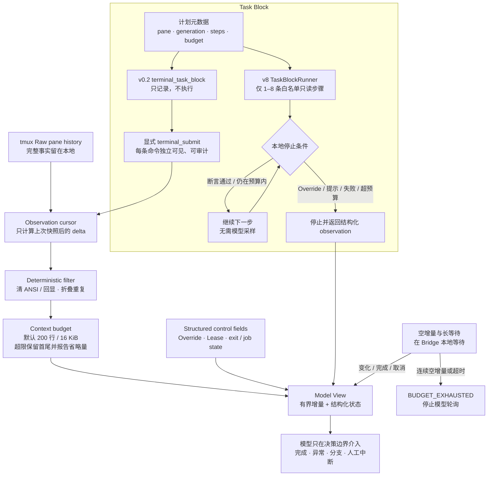

# Shared Terminal Bridge（五）：AI Context Policy 与 Task Block 如何降低终端 Token 消耗

> **系列导航**：[系列目录](../README.md) · 上一篇：[Shared Terminal Bridge（四）：从本地 PoC 到 Codex 可调用的安全终端服务](04-local-poc-to-codex.md) · 下一篇：[Shared Terminal Bridge（六）：长任务、审批、等待与无 Token 关注机制](06-long-jobs-approval-waiting.md)
> **系列定位**：本文是《Shared Terminal Bridge：人与 AI 共用真实终端的演进记录》第 5 篇。前一篇完成了 Local Bridge 与最小 MCP 的服务化；这一篇讨论真正影响 Codex 用量和交互速度的问题：怎样避免把终端垃圾反复放进模型上下文，以及怎样把模型采样从“每条命令之后”移动到真正的决策边界。
## Bridge 很快，为什么任务仍然慢而贵
早期实操已经证明，Bridge 的 Unix socket 请求通常只需要 10–30ms。可一次深入磁盘分析仍可能持续数分钟，并累计处理上百万 input tokens。
“检查 local-33 磁盘占用 03”是第一个完整性能基线：
<table fit-page-width="true" header-row="true">
<tr>
<td>回合</td>
<td>耗时</td>
<td>MCP 调用</td>
<td>处理 token</td>
</tr>
<tr>
<td>基础容量检查</td>
<td>32.845s</td>
<td>6</td>
<td>307,328</td>
</tr>
<tr>
<td>Ctrl+C 中断</td>
<td>41.660s</td>
<td>6</td>
<td>264,532</td>
</tr>
<tr>
<td>root 后深入分析</td>
<td>181.000s</td>
<td>13</td>
<td>777,420</td>
</tr>
</table>
合计 255.505 秒、25 次 MCP 调用、约 134.9 万处理 token。缓存命中约 96.7%，但第三回合仍经历约 15 次模型采样。问题不在 tmux 写入，而在循环本身：
```plain text
读取一段终端
→ 模型重新理解上下文
→ 提交一条命令
→ 等待
→ 再次读取大量重叠内容
→ 模型再次规划
```
这说明单纯依赖会话自身的上下文压缩不够。最便宜、最可靠的 token，是一开始就没有送进模型的 token。
## 原则：完整事实保留，本轮 View 有界
STB 将“终端事实”和“模型上下文”分成两层：
- **Raw pane history**：完整 scrollback 继续由 tmux 保存，是人和 Agent 的共同事实来源；
- **Model View**：Bridge 根据 cursor、过滤和预算构建的当前任务视图，才进入模型上下文。
因此 AI Context Policy 不是删除终端历史，也不是让模型生成一段不可验证的摘要后覆盖原文。它是一层确定性的 admission control：先决定哪些字节值得进入上下文，再让模型做语义理解。
## 从原始输出到模型 View


[Mermaid 源文件](https://github.com/sharpbai/notion-assets/blob/main/tech/shared-terminal-bridge/05-ai-context-task-block.mmd) · [SVG 版本](https://raw.githubusercontent.com/sharpbai/notion-assets/main/tech/shared-terminal-bridge/05-ai-context-task-block.svg) · [PNG 版本](https://raw.githubusercontent.com/sharpbai/notion-assets/main/tech/shared-terminal-bridge/05-ai-context-task-block.png)
## 第一层：用 cursor 避免重放整屏
`terminal_read_delta` 第一次读取当前有界 snapshot，并返回一个 opaque cursor。后续调用携带最近 cursor，Bridge 根据 tmux scrollback 的 suffix overlap 只计算新增部分。
```json
{
  "pane": "%3",
  "cursor": "opaque-previous-cursor",
  "max_bytes": 16384,
  "max_lines": 200
}
```
调用方不能自行构造行号或 offset。Bridge 返回：
- `content`：允许进入模型的增量文本；
- `no_change`：是否没有新内容；
- `raw_delta_lines` 与 `returned_lines`；
- `omitted_lines` 与 `omitted_bytes`；
- 重复折叠和命令回显清理统计；
- `human_override` 与 Lease snapshot。
cursor 是短期观察状态，不是新的事实存储。daemon 重启后旧 cursor fail closed，但 tmux scrollback 仍在，可以建立新的观察基线。
## 第二层：确定性过滤，而不是 LLM 先摘要
进入上下文前，Bridge 做的都是可以复现的处理：
- 清理 ANSI 和无意义 control sequences；
- 去掉内部兼容字段和明确的命令回显；
- 折叠连续重复行；
- 限制最大行数与字节数；
- 超限时保留开头与最新输出，并明确报告省略量。
默认预算是 200 行、16 KiB；硬上限为 1000 行、64 KiB。
第一层不使用 LLM，因为预算本身不能被终端内容中的提示词影响，也不应该为了决定“哪些文本给模型看”先调用一次模型。会话自身的语义压缩仍有价值，但它是最后一道保险，不是垃圾进入上下文前的第一道门。
## 第三层：控制事件永远不被自然语言摘要吞掉
以下信息不应该埋在一大段屏幕文本里：
- Human Override 是否发生；
- 当前 Lease 与 generation；
- job 是否完成、取消或需要输入；
- 输出是否被截断；
- 当前等待为何返回。
它们以结构化字段独立返回。这样即使文本内容被截断，模型仍能可靠遵守“真人已经中断”“Lease 已撤销”“本轮不能继续写”等控制语义。
## terminal_task_block 为什么最初“只记录、不执行”
早期设想是一次向 Bridge 提交多条命令，减少模型往返。但要在未知终端中自动连续执行，最容易走向两种危险实现：
1. 在目标 Shell 注入包装脚本、marker 或临时文件；
2. 假设目标环境支持某种 Shell、解释器、路径和 quoting 规则。
这与 STB“不对执行环境做任何假设”的边界冲突。因此 `terminal_task_block` 被定义为纯本地元数据：
```json
{
  "pane": "%3",
  "generation": 7,
  "commands": ["df -h", "df -i"],
  "stop_on_error": true
}
```
它只做三件事：
- 校验当前 Lease；
- 记录计划步骤、generation 和预算；
- 捕获观察起点并返回 `block_id`。
它不向 pane 发送文字，不创建文件，不改变 TTY，也不假设 pane 里运行的是 Shell。每条实际命令仍由 `terminal_submit` 明确提交，结果通过 `terminal_task_observe` 读取。
“只记录、不执行”不是功能缺失，而是为了先稳定任务范围、观察和中断语义，同时不偷偷扩大写入能力。
## Task Block 与一条命令、一次模型调用的关系
三者不是一对一关系：
<table fit-page-width="true" header-row="true">
<tr>
<td>概念</td>
<td>负责什么</td>
<td>典型数量关系</td>
</tr>
<tr>
<td>模型调用</td>
<td>理解目标、选择路径、处理异常、形成结论</td>
<td>一次可规划多个步骤</td>
</tr>
<tr>
<td>Task Block</td>
<td>限定同一目标、generation、预算和停止条件</td>
<td>一次模型调用可创建一个或多个 block</td>
</tr>
<tr>
<td>终端命令</td>
<td>目标环境中真正可见的原子动作</td>
<td>一个 block 可以包含多条命令</td>
</tr>
</table>
模型并非每次只能执行一条命令。限制来自早期工具粒度：每条命令之后都回到模型，导致“命令数≈模型采样数”。Task Block 的目标是让一次模型决策覆盖一组确定性步骤，同时保留每条命令独立可见、独立审计和逐步 Lease 校验。
## 为什么后来增加独立的 TaskBlockRunner
复杂任务基线暴露了另一面：完全由模型逐条 `submit + wait` 虽然安全，但 65 条命令可能带来数十次模型编排边界。许多步骤只是确定性的只读检查，并不需要模型在中间重新推理。
API v8 因此新增 `terminal_task_block_execute`，但没有改变旧 `terminal_task_block` 的语义。Runner 的首版限制非常保守：
- 一个 block 最多 8 步，总预算最多 120 秒；
- 只允许白名单内的单个只读命令；
- 禁止管道、重定向、Shell 展开和未知可执行文件；
- 每一步都建立独立 job，并在发送前重新校验 Lease 与 generation；
- 支持 `contains`、`not_contains`、`regex` 三种确定性断言；
- 每步只返回最多 2 KiB 摘要和 `job://` 输出引用；
- Human Ctrl+C、交互提示、异常完成、断言失败或上下文变化时立即停止。
Runner 运行在本地 daemon 中，不向目标环境传输脚本。模型一次给出结构化步骤，Bridge 仍逐条向 tmux 发送用户可见的原始命令。
## Bridge 能判断什么，不能判断什么
Bridge 可以无模型判断：
- job 是否仍在运行或已经完成；
- 是否出现新输出；
- generation 和 approval 是否仍有效；
- 当前 job 是否出现密码或确认提示；
- 明确字符串与正则断言是否成立；
- 是否连续空增量、重复错误或超过预算。
Bridge 不能替模型判断：
- 哪个大目录值得继续分析；
- 某个异常是否改变了业务目标；
- 多个修复方案哪个更合适；
- 一个修改动作是否符合用户真实意图。
因此 TaskBlockRunner 只跨越没有语义分支的区间。遇到输出驱动的分支、审批、修改或未知状态，立即停止并把结构化 observation 交回模型。
## 空增量为什么也要有停止预算
没有新输出并不意味着值得再次调用模型。如果每 10 秒执行一次：
```plain text
read → no_change → 模型决定再等 → read → no_change
```
就会把“什么也没发生”变成持续 token 消耗。
`terminal_wait_delta` 把等待放在 Bridge 主机本地：默认单次等待 10 秒、无变化预算 30 秒、总预算 60 秒。连续空增量达到预算后返回 `BUDGET_EXHAUSTED`，模型必须停止轮询。Bridge 不会因为预算耗尽自动发送 Ctrl+C。
长任务则使用 `terminal_wait_job`，一次 MCP 调用可在本地等待最多 10 分钟。只有以下事件才唤醒模型：
- 命令完成；
- Human Ctrl+C；
- 出现密码或确认提示；
- 会话上下文改变；
- 达到策略复核或人工决策点；
- MCP 请求被取消。
取消等待只唤醒 wait，不停止终端 job，也不会向 pane 注入 Ctrl+C。这样后续用户消息不会被旧等待阻塞。
## 真实基线显示了什么改善
会话 14 首轮只使用一次 acquire 和一次 TaskBlockRunner。与会话 13 的可比首次磁盘检查相比：
<table fit-page-width="true" header-row="true">
<tr>
<td>指标</td>
<td>会话 13</td>
<td>会话 14</td>
<td>变化</td>
</tr>
<tr>
<td>耗时</td>
<td>30.661s</td>
<td>28.471s</td>
<td>-7.1%</td>
</tr>
<tr>
<td>Input token</td>
<td>247,452</td>
<td>172,781</td>
<td>-30.2%</td>
</tr>
<tr>
<td>Output token</td>
<td>932</td>
<td>771</td>
<td>-17.3%</td>
</tr>
</table>
但会话 14 也暴露了边界：TestDisk TUI 采用“读整屏—模型判断—发一个键—再读整屏”，91 次按键、26 次全屏读取，消耗约 14.303M input，占全会话约 64%。这说明 Context Policy 可以压缩 Shell 流程，却不能把错误的 TUI 交互粒度变便宜。
后续会话 15 避开 TUI，并使用 Runner 与本地长任务等待，整体 active time 相比会话 14 下降约 65.3%，input token 下降约 78.9%。两次任务并非完全同范围，不能把降幅全部归因于单一改动；但它明确说明：减少模型采样边界和避开逐键 TUI，是比优化毫秒级 Bridge RPC 更大的杠杆。
## Context Policy 的剩余成本
即使终端输出已经得到控制，还有几类成本不属于 Bridge 内容流：
- 每个用户回合重复加载完整 Skill 指令；
- 工具发现与 MCP schema 进入上下文；
- prompt cache 命中虽降低直接成本，但仍增加每次采样的处理量和延迟；
- `wait` 已返回完整终态后又追加一次 status；
- 对短命令过度保守地申请长任务预算。
因此性能回归不能只统计终端输出字节，还要同时记录模型采样数、MCP 调用数、墙钟时间、非缓存 input、总处理 input 和误唤醒次数。
## 这一阶段得到的结论
1. 不应只依赖会话自身压缩；首先要阻止重复和低价值终端内容进入上下文。
2. tmux 保留完整事实，模型默认只消费 cursor-based、有预算的增量 View。
3. Human Override、Lease 和 job state 必须作为结构化控制字段保留。
4. 第一层过滤应是确定性的，不使用 LLM，也不受终端提示词影响。
5. `terminal_task_block` 先“只记录、不执行”，是为了建立边界而不假设目标环境。
6. 一次模型调用可以规划多条命令；Task Block 与命令、模型调用都不是一对一关系。
7. TaskBlockRunner 只自动跨越白名单只读、无语义分支的步骤。
8. 空增量和长等待应留在 Bridge 本地，变化时才唤醒模型。
9. 性能优化的目标不是减少所有命令，而是减少不必要的模型重新编排。
10. TUI 的逐键模式仍是高成本区，必须优先寻找 CLI/CMD/batch 或由人操作到检查点。
---
## 系列导航
上一篇：[Shared Terminal Bridge（四）：从本地 PoC 到 Codex 可调用的安全终端服务](04-local-poc-to-codex.md)
下一篇：**《Shared Terminal Bridge（六）：长任务、审批、等待与无 Token 关注机制》**
## 历史资料
本系列使用以下原始验证和实操记录作为历史依据，原文继续保留：
- [Notion 页面](https://app.notion.com/p/3e147b2dd1458175b152cfd6e8daf43f)
- [Notion 页面](https://app.notion.com/p/3e247b2dd14581589c65d3c6db70a317)

