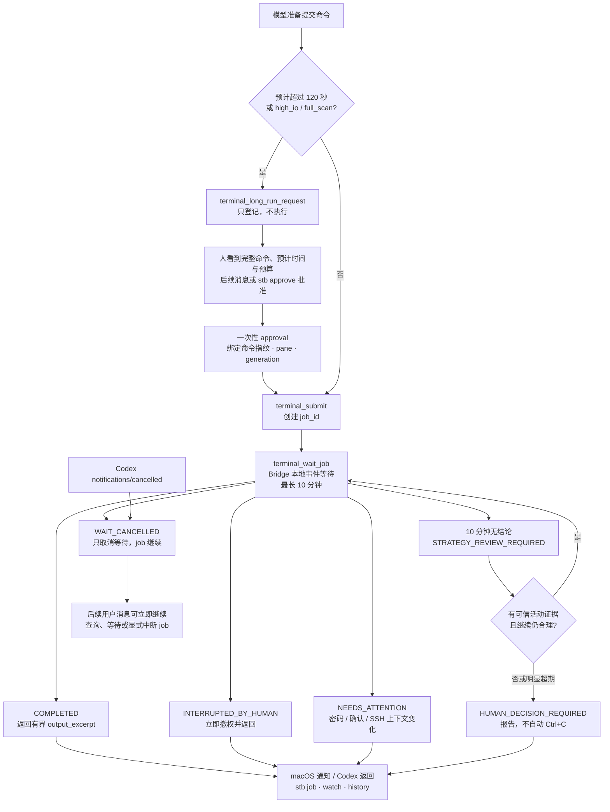

# Shared Terminal Bridge（六）：长任务、审批、等待与无 Token 关注机制

> **系列导航**：[系列目录](../README.md) · 上一篇：[Shared Terminal Bridge（五）：AI Context Policy 与 Task Block 如何降低终端 Token 消耗](05-ai-context-policy-task-block.md) · 下一篇：[Shared Terminal Bridge（七）：TUI 为什么昂贵，以及人机协作的轻量路径](07-tui-lightweight-collaboration.md)
> **系列定位**：本文是《Shared Terminal Bridge：人与 AI 共用真实终端的演进记录》第 6 篇。上一篇把终端输出和模型上下文分层；这一篇继续处理时间：命令需要运行几分钟甚至更久时，怎样既不让模型反复轮询消耗 token，也不让人一直盯着终端，同时保留批准、中断和重新评估的控制权。
## 长任务的难点不是等待，而是谁在等待
磁盘扫描、目录统计、镜像校验和远程诊断经常需要几分钟。最直接的实现是让模型循环：
```plain text
提交命令
→ 等 30 秒
→ 读取终端
→ 模型判断“还没完”
→ 再等 30 秒
→ 再调用模型
```
命令本身可能完全正常，但每次“还没变化”都会触发工具往返、上下文重放和模型采样。人也无法离开，因为不知道什么时候需要输入密码、什么时候完成、什么时候应该换方案。
STB 的方向是把“等待状态机”移到 Local Bridge：模型提交一次，Bridge 在本地等待事件；只有出现值得决策的变化时才返回模型。
## 三种不同时间尺度
STB 不把所有命令都当成长任务，而是按时间与资源影响分层：
<table fit-page-width="true" header-row="true">
<tr>
<td>类型</td>
<td>典型机制</td>
<td>模型介入</td>
</tr>
<tr>
<td>短命令</td>
<td>`terminal_submit`  • `terminal_wait_job`</td>
<td>完成或异常时返回</td>
</tr>
<tr>
<td>输出暂时安静</td>
<td>Bridge 本地 `terminal_wait_delta`</td>
<td>变化或预算耗尽时返回</td>
</tr>
<tr>
<td>预计超过 120 秒或高 I/O</td>
<td>先请求人工批准，再创建 job</td>
<td>批准、策略复核或人工决策点</td>
</tr>
</table>
这样，模型不需要为每一个等待窗口重新回答“是否继续”。
## 为什么长命令必须先显示完整命令
时间长通常意味着更高成本或更大影响：全盘 `du` 会产生大量 I/O，镜像转换会持续占用存储，错误路径的递归扫描可能拖累业务。
因此满足任一条件时必须进入批准流程：
- `expected_duration_ms > 120000`；
- `resource_class = high_io`；
- `resource_class = full_scan`。
模型先调用 `terminal_long_run_request`。这个调用只在 Bridge 中登记请求，**不会执行命令**。返回内容包括完整命令、预计时间、资源类型、idle budget、total budget 和 `request_id`。
模型必须把完整命令和预算展示给人并结束当前回合。用户在后续消息中回复“批准”或“确认执行”即可，不需要再复制一遍命令。
本机管理员也可以绕过模型界面，用：
```plain text
stb approvals
stb approve REQUEST_ID
stb reject REQUEST_ID
```
做出决定。审批不会向 pane 注入任何提示或控制文本。
## Approval 不是一个通用的“可以执行”开关
批准结果被严格绑定到：
```plain text
request_id
+ command SHA-256
+ pane
+ generation
+ resource_class
+ expected / idle / total budget
```
`terminal_long_run_approve` 生成一次性 approval ID，只能被一次 `terminal_submit` 消费。
因此批准一条 `du` 不会顺便授权另一条命令；重新获得 generation 后，旧 approval 也不能被挪用。审批解决的是“人是否同意这一条完整长命令”，Execution Lease 仍解决“这一刻当前 generation 是否有权写入 pane”。
## 从批准到通知的完整生命周期


[Mermaid 源文件](https://github.com/sharpbai/notion-assets/blob/main/tech/shared-terminal-bridge/06-long-job-attention.mmd) · [SVG 版本](https://raw.githubusercontent.com/sharpbai/notion-assets/main/tech/shared-terminal-bridge/06-long-job-attention.svg) · [PNG 版本](https://raw.githubusercontent.com/sharpbai/notion-assets/main/tech/shared-terminal-bridge/06-long-job-attention.png)
## Job 把“命令执行”和“MCP 等待”分开
`terminal_submit` 接受命令后返回 `job_id`。此后有两个独立对象：
- **terminal job**：目标 pane 中实际运行的命令；
- **wait request**：某次 MCP 调用正在等待这个 job 的变化。
这一区分非常重要。等待可以被取消、超时或由 App 中止，但 job 不应该因此自动收到 Ctrl+C。
```plain text
cancel wait ≠ cancel command
```
只有明确的 `terminal_interrupt`、真人 Ctrl+C 或其他授权动作，才能影响前台命令。
## terminal_wait_job 为什么能减少 token
早期轮询每隔几十秒唤醒一次模型。`terminal_wait_job` 则让一次 MCP tool call 在 Bridge 本地最多等待 10 分钟：
- Bridge 观察 pane 增量、前台程序和提示符；
- 没有决策价值的状态变化不触发模型采样；
- 完成、人工中断、交互提示或策略边界出现时立即返回；
- wait 返回有界 `output_excerpt`，正常路径无需再调用一次 status。
等待期间并不是让模型连续“思考十分钟”。MCP 请求保持挂起，Bridge 在本地线程和 Event 上等待；没有新一轮模型采样，就不会因为每分钟检查而反复消耗对话 token。
项目级 MCP timeout 设置为 660 秒，为 10 分钟本地等待预留协议余量。
## 不向目标环境注入完成 marker
一个常见做法是在命令后追加：
```plain text
; echo __DONE__$?
```
或生成包装脚本。STB 不这样做，因为它会改变用户原始命令，对不同 Shell、SSH、设备 CLI 和交互程序做额外假设。
Job 的完成判定来自本地观察：
- 提交前的提示符状态；
- 命令回显后的增量；
- 提示符是否回归；
- 1.5 秒稳定期；
- 前台程序变化；
- 结构化 Human Override。
这是启发式判断，所以结果带 `completion_confidence`，而不是伪装成目标进程提供的绝对退出码。完整性不确定时，系统倾向返回需要注意，而不是自动推进下一步。
## 十分钟不是硬性终止时间
10 分钟到达时，Bridge 返回：
```plain text
STRATEGY_REVIEW_REQUIRED
```
这并不会停止 job。模型应进行一次低频启发式复核：
- 是否有可信的新输出；
- `last_meaningful_activity_at` 是否持续更新；
- 当前策略是否仍比替代方案合理；
- 预计时间是否需要根据历史修正；
- 是否应该改成更窄的命令或换工具。
只有存在有意义的活动证据时才继续下一段等待。不能把屏幕中任意百分号解释成进度；未知命令的 `progress` 默认为 `null`。
如果明显超过合理预期，则进入：
```plain text
HUMAN_DECISION_REQUIRED
```
人工决策点为：
```plain text
max(预计时间 × 3, 20 分钟)
```
Bridge 只报告，不自动发送 Ctrl+C。因为“超时”可能意味着任务很慢、远端卡住、磁盘异常或预计错误，停止本身也是一个需要授权的动作。
## 事件驱动取消解决了“中止等待后会话阻塞”
早期实现使用固定轮询周期检查取消，手工中止 MCP 等待后，旧调用可能仍占用 adapter 的处理路径，导致后续用户消息阻塞。
后来 MCP adapter 改为并发处理 stdio 请求，并给每次等待分配独立 `wait_id`。当 Codex 发送：
```plain text
notifications/cancelled(requestId)
```
adapter 通过另一条 Unix socket 请求调用 `terminal_cancel_wait`。Bridge 直接设置对应 Event，等待线程立即醒来并返回：
```plain text
WAIT_CANCELLED
```
这个过程不依赖下一轮固定轮询，不发送终端按键，也不改变 job 状态。后续用户消息可以立刻查询 job、重新等待或显式中断。
## 哪些变化值得立即唤醒
Job wait 不只是“完成或没完成”。以下情况都应立即返回：
- **COMPLETED**：提示符回归并经过稳定期，附带有界结果；
- **INTERRUPTED_BY_HUMAN**：真人 Ctrl+C，Lease 同时被撤销；
- **NEEDS_ATTENTION**：出现当前 job 的密码、确认或其他交互提示；
- **session_context_changed**：提交时前台是 SSH、mosh 或 telnet，等待时已经退出到本地 Shell；
- **WAIT_CANCELLED**：App 或用户取消了等待，但 job 仍运行；
- **STRATEGY_REVIEW_REQUIRED**：达到低频策略复核点；
- **HUMAN_DECISION_REQUIRED**：明显超过合理预期。
提示检测只检查命令回显锚定后的当前 job 输出窗口，不能扫描整个 pane history。否则旧的 sudo 密码提示会让新任务误判为需要输入。
## App 回调与“无 Token 等待”的现实边界
在当前结构中，最接近回调的是一个保持中的 MCP tool call：Bridge 发生终态或关注事件后，工具调用返回，Codex 当前任务继续处理结果。这期间不会按固定间隔重复调用模型。
如果 Codex App 取消当前 tool request，Bridge 能即时结束 wait；但 job 仍由 tmux 承载。STB 不依赖 App 必须永久保持一个会话在线，而是同时提供两种人类注意力机制：
1. daemon 在完成、人工中断、需要输入或需要重新评估时发送 macOS 本地通知；
2. 人可以通过 `stb jobs`、`stb job`、`stb watch` 直接观察，不经过模型、不消耗 Codex token。
因此“无 Token 关注”不是让 Codex 无限后台推理，而是把事实等待、状态跟踪和人类提醒放到本地服务；需要语义判断时才把一个有界结果交给模型。
## 人工注意力入口
常用管理命令包括：
```plain text
stb jobs
stb jobs --state RUNNING
stb job JOB_ID
stb wait JOB_ID
stb watch JOB_ID
stb interrupt JOB_ID
stb waits
stb cancel-wait WAIT_ID
```
这些命令让用户可以离开 Codex 对话，直接查看托管 job。`stb watch` 只消费本地状态；真正需要停止时再执行显式 `stb interrupt`，避免“退出观察界面”等同于“杀掉任务”。
## 历史数据怎样帮助改善预计
会话 15 中，多条 `du` 被按 5–10 分钟申请，实际由于页缓存或目录结构只运行了几十秒。审批边界仍然正确：它们属于高 I/O/full scan，不能因为这次很快就取消人工批准。
更合理的优化是利用同一会话、同一文件系统、同类命令的历史 job 数据给出建议预计，同时保留资源类别的批准要求。
持久历史记录：
- 请求与批准；
- 完整显式提交；
- job 状态和有界输出摘要；
- Human/Agent interrupt；
- 实际持续时间与最后活动证据。
历史文件权限为 `0600`，明显包含 password/token/secret 赋值的命令整体脱敏。它既支持后续预计校准，也是复盘模型等待和误唤醒的基准。
## 从实操中得到的修正
长任务机制经过几轮实际操作后收敛出这些规则：
1. 长命令先展示完整命令，不能只提示“需要批准”；
2. 请求与批准分成两个用户回合，避免模型在同一回合自批；
3. Approval 必须一次性、绑定命令指纹和 generation；
4. 10 分钟是策略复核点，不是自动中断点；
5. wait 完成后应直接带回有界输出，禁止正常路径追加 status；
6. MCP 取消只取消 wait，不隐式停止 job；
7. 远程会话退出应立即返回，不应继续等满预算；
8. 本地通知和 `stb watch` 承担人的注意力管理，不需要模型持续在线。
## 这一阶段得到的结论
1. 长任务的 token 成本主要来自模型轮询，而不是命令持续时间本身。
2. 预计超过 120 秒或高 I/O/full scan 必须在后续用户消息中明确批准。
3. Approval 绑定完整命令、pane、generation 和预算，且只能使用一次。
4. Job 与 wait 是两个对象；取消等待绝不能等同于中断命令。
5. Bridge 本地一次等待最多 10 分钟，不产生周期性模型采样。
6. 10 分钟后只做一次策略复核，明显超期才交给人工决定。
7. 完成检测保持启发式并报告置信度，不向目标环境注入 marker。
8. App 取消事件通过 Event 即时唤醒，不再依赖硬轮询周期。
9. macOS 通知和 `stb watch` 让人无需一直盯着终端或 Codex。
10. 无 Token 等待的本质是本地状态机和通知，不是后台无限调用模型。
---
## 系列导航
上一篇：[Shared Terminal Bridge（五）：AI Context Policy 与 Task Block 如何降低终端 Token 消耗](05-ai-context-policy-task-block.md)
下一篇：**《Shared Terminal Bridge（七）：TUI 为什么昂贵，以及人机协作的轻量路径》**
## 历史资料
本系列使用以下原始验证和实操记录作为历史依据，原文继续保留：
- [Notion 页面](https://app.notion.com/p/3e147b2dd1458175b152cfd6e8daf43f)
- [Notion 页面](https://app.notion.com/p/3e247b2dd14581589c65d3c6db70a317)

