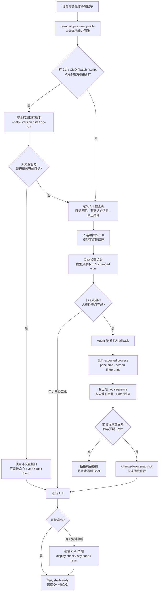

# Shared Terminal Bridge（七）：TUI 为什么昂贵，以及人机协作的轻量路径

> **系列导航**：[系列目录](../README.md) · 上一篇：[Shared Terminal Bridge（六）：长任务、审批、等待与无 Token 关注机制](06-long-jobs-approval-waiting.md) · 下一篇：[Shared Terminal Bridge（八）：从 Codex MCP 到 ChatGPT STB-RDC](08-codex-mcp-to-chatgpt-stb-rdc.md)
> **系列定位**：本文是《Shared Terminal Bridge：人与 AI 共用真实终端的演进记录》第 7 篇。前两篇分别处理了上下文预算和长任务等待；这一篇聚焦最难压缩的交互形态：ncurses、菜单和全屏 TUI。结论不是建设一个重型通用 TUI Agent，而是重新选择交互路径，让 CLI/CMD 和人类操作承担它们更擅长的部分。

## TUI 为什么会突然吃掉大量 token

普通 Shell 命令的交互粒度通常是：提交完整命令，等待一段输出，再根据结果决定下一步。一次模型决策可以覆盖多个确定性步骤。
TUI 则常常退化成：

```text
读取整屏
→ 模型判断焦点和菜单状态
→ 发送一个方向键或 Enter
→ 再读取整屏
→ 模型重新判断

```

每个按键都可能改变选中项、滚动位置、对话框或前台程序。模型无法只凭上一帧保证下一次 Enter 的含义，因此“一个键≈一次模型采样”很容易成为默认模式。
单个 `terminal_key` 的 Bridge 延迟很低，真正昂贵的是每一步都重新注入全屏、工具说明和对话上下文。

## TestDisk 实操给出的量化结果

“查看 local-33 磁盘占用 14”中，普通磁盘检查已经受益于 TaskBlockRunner：首次检查 input token 相比会话 13 下降约 30.2%。但任务进入 TestDisk ncurses 后，成本结构完全改变。
三个主要 TUI 回合合计：

- 91 次按键调用；
- 26 次全屏读取；
- 约 878.9 秒，接近 14.6 分钟；
- 约 14.303M input token；
- 占整个会话 input token 的约 64%。
这说明即使 delta、wait、Lease 和 Task Block 都已存在，只要交互粒度仍是“读整屏—按一个键”，模型编排成本就会压倒 Bridge 的所有毫秒级优化。

## TUI 不只是输出多，而是状态隐含

全屏程序的关键状态往往不在可提取文本中：

- 当前焦点在哪个控件；
- 选中项是高亮、反色还是光标位置；
- 是否位于 alternate screen；
- Enter 会确认、进入子菜单还是执行写操作；
- 前台程序是否已经退出；
- 终端是否仍处于 raw mode；
- 同一字符究竟是界面内容还是 Shell prompt。
屏幕看起来只改变一两行，语义却可能完全不同。反过来，屏幕大面积重绘也可能只是光标移动。基于文本 delta 的 Context Policy 在这里无法直接等价于“语义变化”。

## 最危险的竞态：按键越过 TUI 生命周期

会话 14 在退出 TestDisk 后出现了命令错位和 `elsblk` 之类异常输入。实测尺寸是：

```text
tmux client: 103x30
window/pane: 103x29
stty size:   29x103

```

宽度一致，高度差一行来自 tmux 状态栏，因此不是简单的 pane 几何错误。更可能的原因是：

- ncurses 被强制中断后没有完整恢复 alternate screen；
- 自动换行、光标或 raw/cooked 模式没有恢复；
- Agent 已经排队的下一组按键在 TUI 退出后落入 Shell；
- 模型把仍属于 TUI 的画面误判为 Shell ready。
这比多花 token 更严重：一个原本意图移动菜单的字符可能变成 Shell 命令的一部分。
因此只要前台程序与预期不一致，剩余按键就必须全部拒绝。

## 最终确定的三层选择顺序

STB 不把“支持 TUI”理解为让 Agent 默认接管所有菜单，而是按成本和可靠性选择路径：

```text
官方 CLI / CMD / batch / script
        ↓ 无法覆盖
人类连续操作 TUI，模型在检查点观察
        ↓ 仍无法完成
Agent 轻量、受限 TUI fallback

```

这个顺序既降低 token，也更符合人与模型的优势：模型擅长分析结构化输出和规划，人擅长快速浏览菜单、识别视觉焦点并连续操作。

## 程序交互模式选择树




[Mermaid 源文件](https://github.com/sharpbai/notion-assets/blob/main/tech/shared-terminal-bridge/07-tui-interaction-routing.mmd) · [SVG 版本](https://raw.githubusercontent.com/sharpbai/notion-assets/main/tech/shared-terminal-bridge/07-tui-interaction-routing.svg) · [PNG 版本](https://raw.githubusercontent.com/sharpbai/notion-assets/main/tech/shared-terminal-bridge/07-tui-interaction-routing.png)

## 第一优先级：先寻找程序原生非交互接口

许多看似只能操作菜单的程序其实提供：

- CLI 子命令；
- `/cmd` 或 batch 模式；
- script 文件；
- list、dry-run 和只读探测；
- 日志、JSON、CSV 或其他导出格式。
TestDisk 官方支持：

```text
testdisk /cmd device command-list

```

可用命令包括 `analyze`、`list`、递归 list、`advanced` 以及部分文件系统的 `undelete` 入口。PhotoRec 也提供 `/cmd` 与输出目录参数。
非交互接口的优势不只是省 token：命令完整可见、可以审计、可以绑定 Approval，也更容易形成 Job 和结构化结果。
但“程序有 CMD 模式”不代表当前目标一定能全部批处理。例如选择性的 exFAT 恢复可能仍需 TUI。因此必须先做版本与能力探测，不能根据本地知识假设目标机版本支持某参数。

## terminal_program_profile 只提供本地指引

API v9 增加 `terminal_program_profile`，首批覆盖 TestDisk 和 PhotoRec。它返回：

- 推荐接口，例如 `cmd`；
- 已知的版本探测方式；
- 可参考的只读命令模式；
- TUI fallback 策略，例如 `human_assisted`。
这个工具：

- 不要求 Execution Lease；
- 不读取 pane；
- 不向终端发送命令或按键；
- 不声称目标机一定具备对应版本能力。
它是一个本地“选路提示”，不是执行器。模型仍需在目标环境用安全的 `--help`、version、list 或 dry-run 验证。

## 白名单必须精确到调用模板

为了减少进入 TUI 的机会，TaskBlockRunner 增加了少量明确只读模板：

```text
fdisk -l TARGET
fdisk --list TARGET
blkid -p TARGET
blkid -p -O NON_NEGATIVE_OFFSET TARGET
testdisk /version
qemu-nbd --version
qemu-nbd -V

```

以下调用仍在写入 pane 前被拒绝：

```text
fdisk TARGET
blkid TARGET
testdisk DEVICE
qemu-nbd --connect=...

```

系统没有把整个 `fdisk`、`blkid` 或 `qemu-nbd` 程序标记成“安全”。能力白名单必须精确到参数形状，因为同一个可执行文件既可能只读，也可能修改分区表、连接块设备或改变状态。

## 第二优先级：人操作，模型在检查点观察

如果非交互接口不能覆盖目标，默认工作流变成：

1. 模型说明要进入哪个界面；
2. 告诉用户要查找哪些信息；
3. 明确到达什么状态就停止操作；
4. 当前模型回合结束；
5. 用户在真实 tmux 中连续操作；
6. 到达检查点后发出新消息；
7. 模型读取一次当前屏幕或 changed view，继续分析。
这种模式不是把任务全部甩给人。模型仍负责路径规划、风险提示和结果解释；人只承担连续菜单操作，不需要让模型为每个方向键重新采样。
在共享 tmux 中，人看到的就是模型后续观察的同一个 pane，因此不需要截图转发或描述每一步。

## 第三优先级：Agent 受限操作 TUI

只有在非交互路径不足、人工检查点也不适用时，才让 Agent 操作 TUI。即使进入 fallback，也不建设通用视觉 Agent，而只做低成本、高收益的保护：

- 操作前记录 expected foreground process；
- 记录 pane 尺寸和 screen fingerprint；
- 支持有上限的小型 key sequence；
- 连续方向键可以合并，但 Enter、确认和修改动作保持独立边界；
- 每批按键前重新检查前台程序；
- Human Ctrl+C 或人开始操作时立即停止剩余按键；
- 当前可见屏幕优先返回 changed rows，而不是重复整个画面。
这不会让 Bridge 理解所有控件，也不会自动规划复杂菜单。它只降低逐键操作的固定成本，并防止按键越过程序生命周期。

## 为什么 Enter 不能轻易合并

方向键通常只改变选择位置，而 Enter 经常是副作用边界：

- 打开子菜单；
- 确认覆盖；
- 开始扫描；
- 写入分区表；
- 退出程序；
- 在 TUI 已退出时执行 Shell 输入。
因此可以将有限数量的连续方向键合并成一次本地 sequence，但 Enter 应保持独立校验和观察边界。涉及写入或破坏性确认时，还必须回到 Approval 与 Lease 规则。

## changed-row snapshot 能省什么，不能省什么

如果一帧只改变了选中项，重复发送完整 100×30 屏幕没有必要。changed-row snapshot 可以返回：

- 哪些行变化；
- 新的可见文本；
- 屏幕 fingerprint；
- 前台进程和 pane 尺寸。
它能减少重复文本，却不能自动恢复控件语义。反色、高亮和光标位置仍可能需要保留必要属性；如果 fingerprint 或进程意外变化，系统应停止而不是继续根据旧状态操作。

## 退出 TUI 必须是显式生命周期阶段

正常情况下优先使用程序自身的退出键，让 ncurses 恢复终端状态。退出后，在发送下一条业务命令前必须确认：

- 前台程序已经回到预期 Shell；
- prompt 可识别；
- pane 尺寸与模式正常；
- 没有遗留按键队列。
如果使用 Ctrl+C 强制退出，则先做 display check。必要时由人或显式命令执行：

```text
stty sane
reset

```

只有 shell-ready 确认通过，才恢复普通命令提交。Human Ctrl+C 撤销当前 generation 的写权限，也自然阻止了旧 TUI 按键继续落入 Shell。

## 为什么不建设重型通用 TUI 自动化

一个真正通用的 TUI Agent 需要：

- 终端仿真与 alternate screen 模型；
- 控件识别和焦点追踪；
- ANSI 样式与光标语义；
- 多种 ncurses/readline/设备 CLI 兼容；
- 自动菜单规划；
- 视觉理解和错误恢复。
这会把一个薄的本地 Bridge 变成新的 Terminal 平台，与项目“复用真实 tmux、不重新开发 AI Terminal”的方向冲突。它也很难证明按键不会在程序退出后泄漏到 Shell。
STB 因此只保留那些不改变架构、又能明显降低风险和 token 的能力：能力选路、人工检查点、进程生命周期保护、有限 key sequence 和 changed-row observation。

## 会话 15 为什么顺畅很多

会话 15 完全避开 TUI，使用 TaskBlockRunner 处理普通只读检查，长扫描走批准与本地等待。相比会话 14：

<table fit-page-width="true" header-row="true">
<tr>
<td>指标</td>
<td>会话 14</td>
<td>会话 15</td>
<td>变化</td>
</tr>
<tr>
<td>活跃时间</td>
<td>1,743.958s</td>
<td>604.434s</td>
<td>-65.3%</td>
</tr>
<tr>
<td>Input token</td>
<td>22.439M</td>
<td>4.727M</td>
<td>-78.9%</td>
</tr>
<tr>
<td>TUI 按键</td>
<td>91</td>
<td>0</td>
<td>-100%</td>
</tr>
<tr>
<td>全屏读取</td>
<td>26</td>
<td>0</td>
<td>-100%</td>
</tr>
</table>
两次任务范围不完全相同，不能把所有改善归因于一个功能。但 TestDisk TUI 单独就占会话 14 约 14.303M input，完全避开它显然是最大的收益来源。

## 这一阶段得到的结论

1. TUI 的主要成本是“每个按键都触发一次模型采样”，不是 Bridge 按键延迟。
2. 全屏状态包含焦点、光标、样式和前台程序等隐含语义，文本 delta 不能完全代表状态。
3. 先查 CLI/CMD/batch/script，再考虑进入 TUI。
4. `terminal_program_profile` 只提供本地指引，不替代目标版本验证。
5. 只读白名单必须精确到参数模板，不能按整个可执行文件授权。
6. 非交互能力不足时，优先让人连续操作到检查点，模型只观察一次。
7. Agent TUI 只做轻量 fallback，并必须绑定 expected process 和 screen fingerprint。
8. 方向键可以有限合并，Enter 和确认保持独立边界。
9. 强制退出后必须确认 shell-ready，并在必要时恢复终端显示。
10. STB 不建设通用控件识别、视觉菜单规划或新的终端仿真平台。

---

## 系列导航

上一篇：[Shared Terminal Bridge（六）：长任务、审批、等待与无 Token 关注机制](06-long-jobs-approval-waiting.md)
下一篇：**《Shared Terminal Bridge（八）：从 Codex MCP 到 ChatGPT STB-RDC》**

## 历史资料

本系列使用以下原始验证和实操记录作为历史依据，原文继续保留：

- [Notion 页面](https://app.notion.com/p/3e147b2dd1458175b152cfd6e8daf43f)
- [Notion 页面](https://app.notion.com/p/3e247b2dd14581589c65d3c6db70a317)
