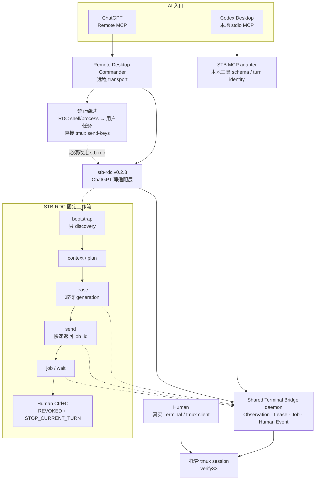

# Shared Terminal Bridge（八）：从 Codex MCP 到 ChatGPT STB-RDC

> **系列导航**：[系列目录](../README.md) · 上一篇：[Shared Terminal Bridge（七）：TUI 为什么昂贵，以及人机协作的轻量路径](07-tui-lightweight-collaboration.md) · 下一篇：[Shared Terminal Bridge（九）：从 PoC 到可用工具，十五轮实操如何驱动架构收敛](09-fifteen-iterations.md)
> **系列定位**：本文是《Shared Terminal Bridge：人与 AI 共用真实终端的演进记录》第 8 篇。前七篇记录了 STB 在 Codex 本地 MCP 中的形成过程；这一篇进入新的客户端边界：ChatGPT 通过 Remote Desktop Commander 连接本机时，怎样继续使用同一套 tmux、HumanEventLayer、Execution Lease 和 Job 语义，而不是重新实现第二套远程终端控制系统。

## 为什么还要把 STB 带到 ChatGPT

STB 最初围绕 Codex Desktop 构建。这个组合的优势很明确：Codex、MCP server、Bridge daemon 和 tmux 都运行在同一台 Mac 上，本地 Unix socket 简单、延迟低，安全边界也容易验证。
但它同时带来一个产品层限制：**Codex 是纯单机、本地工作区里的入口。** 当人离开这台 Mac，换到另一台电脑、手机或其他可以使用 ChatGPT 的环境时，就很难继续发起同一台实体机器上的操作。即使机器和 tmux session 仍然在线，触发入口仍被绑定在本地 Codex 会话。
实际需求并不只是“远程执行一条 shell 命令”，而是两个更完整的目标：

1. **从不同环境触发实体机器上的任务。** 人可以在任意能够进入 ChatGPT、并已连接 RDC 的客户端发起检查或运维任务，真正的命令仍在那台实体机器已有的 tmux pane 中执行。
2. **方便地共享和延续上下文。** 新的 ChatGPT 会话应能知道当前托管 session、pane、已有 SSH 连接、最近终端输出、Job 与 Lease 状态，而不是每次让人重新描述“已经登录哪台机器、刚才执行到哪里”。
这里的“任意环境”并不意味着把本机 shell 直接暴露到公网，也不意味着 ChatGPT 获得不受限制的远程执行权。它表示：**交互入口可以跨设备，执行事实和安全控制仍留在实体机器本地。**
tmux 天然适合作为这层共享上下文：人在本机看到的终端、Codex 操作的 pane、ChatGPT 经 RDC 访问的 session，最终指向同一个事实来源。`bootstrap` 和有界 context 只把当前任务需要的状态带给新会话；Execution Lease、Human Override、Job 与审计仍由本地 STB 强制。
因此，把 STB 带入 ChatGPT 不是为了替代 Codex，也不是再造一个云端 Terminal，而是把系统从：

```text
只能在实体机器上的 Codex 中发起协作

```

扩展为：

```text
任意 ChatGPT 入口发起意图
        ↓
RDC 连接指定实体机器
        ↓
本地 STB 校验授权与状态
        ↓
同一个 tmux 保留并共享真实上下文

```

Codex 仍是本地开发和深度操作的高效入口；ChatGPT 增加的是跨设备触发、继续对话和上下文接续能力。

## 从 Codex 到 ChatGPT，变化的是入口，不是终端事实

Codex Desktop 可以直接启动本地 stdio MCP server，再通过 Unix socket 调用 STB daemon。ChatGPT 没有同样的本地进程入口，但可以通过 Remote Desktop Commander（RDC）的 Remote MCP 连接用户电脑。
最容易想到的方案是让 ChatGPT 直接使用 RDC 的 shell/process 工具运行 `df`、`du` 或 SSH。它确实能执行命令，却会绕开 STB 已经建立的全部控制语义：

- 命令不一定进入人正在看的 tmux pane；
- Human Ctrl+C 无法撤销同一条执行链；
- 没有 pane-scoped Execution Lease；
- stale generation 无法在写入前被拒绝；
- Job、wait 和操作审计形成另一套状态；
- 人与 AI 不再共享同一个终端事实来源。
所以 STB-RDC 的目标不是“让 ChatGPT 获得一个远程 Shell”，而是：

> **让 ChatGPT 通过远程 transport 调用现有 STB，同时保持本地安全边界完全不变。**

## 四层职责必须保持分离

最终架构固定为：

```text
RDC      = transport
stb-rdc  = ChatGPT adapter
STB      = Terminal / HumanEventLayer / Lease / Job / Safety
tmux     = Human 与 AI 的共享终端事实

```

RDC 只负责让 ChatGPT 能够到达本机。`stb-rdc` 把适合 ChatGPT 冷启动和工具调用的命令转换成 STB Unix socket RPC。真正的状态所有者仍是 STB daemon。
Adapter 不直接调用 tmux，不复制 HumanEventLayer，也不实现自己的 Lease。

## Codex MCP 与 ChatGPT STB-RDC 在同一核心汇合




[Mermaid 源文件](https://github.com/sharpbai/notion-assets/blob/main/tech/shared-terminal-bridge/08-codex-to-stb-rdc.mmd) · [SVG 版本](https://raw.githubusercontent.com/sharpbai/notion-assets/main/tech/shared-terminal-bridge/08-codex-to-stb-rdc.svg) · [PNG 版本](https://raw.githubusercontent.com/sharpbai/notion-assets/main/tech/shared-terminal-bridge/08-codex-to-stb-rdc.png)

## v0.1：先证明远程链路没有破坏安全语义

STB-RDC v0.1 是一个独立项目：

```text
shared-terminal-bridge-rdc/
├── stb-rdc
├── README.md
├── CHANGELOG.md
└── VALIDATION-v0.1.md

```

首版只提供少量命令：

```text
status
context SESSION
lease SESSION
send SESSION GENERATION COMMAND
job JOB_ID
wait JOB_ID
interrupt JOB_ID

```

Adapter 通过 `/tmp/shared-terminal-bridge.sock` 调用已经运行的 STB。它不修改旧 STB 项目，也不新增远程专用 Lease。
第一次正常命令验收使用：

```text
printf 'STB_RDC_V01_OK\n'

```

命令经过 RDC → Adapter → STB → `verify33`，Job 识别 prompt return 为 `COMPLETED`，终端中能看到标记文本。
验收期间还发现一个真实接口错误：Adapter 把 `terminal_submit` 参数写成了 `command`，而 STB API 实际要求 `text`。修正后重新通过提交、Job 与 Human Override 验证。这个小问题说明薄 Adapter 的价值之一，就是把上游客户端差异集中在很小的兼容层，而不污染核心 Bridge。

## Human Override 第一次跨过 Remote MCP 返回 ChatGPT

最关键的 v0.1 验收不是普通命令，而是远程 blocking wait 中的人类中断：

```text
generation 16 ACTIVE
→ stb-rdc send "sleep 120"
→ STB 创建 job
→ ChatGPT 通过 RDC 调用 stb-rdc wait --seconds 60
→ 人在 iTerm2 的 verify33 中按 Ctrl+C
→ HumanEventLayer 捕获事件
→ STB 撤销 Lease 并唤醒 wait
→ RDC 将结果返回当前 ChatGPT turn

```

实测约 7.8 秒内返回：

```text
state: INTERRUPTED_BY_HUMAN
completion_confidence: authoritative
recommended_action: STOP_CURRENT_TURN

```

这次不需要用户再回 ChatGPT 说“已中断”。Human Event 本身就通过正在阻塞的工具调用反向唤醒当前 turn。
随后故意用同一个 generation 再次发送：

```text
STALE_WRITE_SHOULD_NOT_RUN

```

STB 返回 `EXECUTION_LEASE_INVALID`，文本没有进入 Terminal。由此证明，即使 ChatGPT 忽略 `STOP_CURRENT_TURN`，本地 Bridge 仍会拒绝过期写入。

## 为什么新 ChatGPT 会话需要 bootstrap

Codex 项目里有本地 routing skill 和 MCP tool schema，新任务能较容易发现如何使用 STB。全新的 ChatGPT 会话则不知道：

- `verify33` 是托管 session；
- pane 中已经 SSH 到 `local-33`；
- 当前前台是 Ubuntu Shell；
- 写入需要 Lease；
- Human Ctrl+C 后必须停止当前 turn；
- wait timeout 不等于 job failure。
如果每次都由用户解释这些背景，tmux 就没有真正成为上下文载体。
v0.2 因此新增：

```text
stb-rdc bootstrap verify33

```

一次返回：

- Adapter 与 STB 版本；
- Bridge API 版本；
- session、pane 和 terminal state；
- 默认 40 行、去除首尾空行的有界 context；
- 当前 execution / Human Override 状态；
- interaction policy；
- 推荐工作流。
用户启动语由此可以收敛成：

> **使用 STB-RDC，通过 verify33 帮我看下磁盘占用。**
不再需要重复说明已经 SSH 到哪台机器、是什么操作系统。

## Bootstrap 只做 discovery

`bootstrap` 的安全边界非常明确：

```text
ready = true
task_executed = false
discovery_only = true

```

它可以读取 session、context 和 policy，但不能顺便执行用户真正的 `df` 或 `du`，不能取得 Lease，也不能把“了解环境”和“产生副作用”合并成一个不透明远程调用。
当前固定工作流是：

```text
bootstrap
→ context / plan
→ lease
→ send
→ job / wait

```

其中 `send` 应快速返回 `job_id`，长时间运行由 STB Job 和 wait 承担。

## 最大风险：RDC 本身拥有通用执行能力

RDC 为远程桌面管理提供 shell/process 工具。如果 ChatGPT 在 bootstrap 之后直接用这些工具执行 `df`、`du`、`ssh`，功能上可能成功，但架构已经失效。
因此 v0.2.3 明确声明唯一合法路径：

```text
RDC → stb-rdc → STB → tmux

```

并把两个绕过方式定义为禁止：

```text
direct_rdc_shell_execution_forbidden = true
direct_tmux_send_keys_forbidden = true

```

RDC 的 shell/process 可以用来启动 Adapter 或读取项目文件，但不能直接执行用户要求的共享 Terminal 运维任务。真正的 Terminal 写入必须携带 STB generation。
“检查磁盘占用02”曾出现模型直接把 RDC 当执行层的情况，这比等待提示缺失更严重，因此 v0.2.3 把执行路径约束设为最优先规则。

## v0.2.1 的失败：不能要求普通消息后自动继续

为了改善 Remote MCP 长调用期间的沉默，v0.2.1 曾尝试：

```text
bootstrap
→ 强制返回用户一条普通消息
→ 后续自动继续执行

```

Adapter 返回 `must_return_to_user_now=true`，要求模型不要在同一个 tool loop 执行真正任务。
实际问题是：普通 assistant message 往往意味着当前 turn 结束。没有新的用户消息，ChatGPT 不一定会自动开启下一轮工具执行。
结果可能是：

- 模型忽略规则，继续 tool loop；
- 模型遵守规则，输出一句状态后任务永久停住。
这是 ChatGPT turn orchestration 的边界，不是 Adapter 文案能可靠改变的能力。v0.2.2 因此撤销强制返回设计，允许 bootstrap 后在同一个 tool loop 继续。

## 为什么最终放弃“调用前必须提示”协议

另一轮尝试要求 ChatGPT 在预计超过 5 秒的 Remote MCP 调用前先输出自然语言说明。它遇到两个问题：

1. 冷启动 paradox：要调用 RDC 才能读取 bootstrap policy，但规则要求在调用 RDC 前提示；
2. tool loop 限制：MCP server 可以返回指导，却不能强制 ChatGPT UI 在两个 tool call 中间插入普通消息。
工具进度 UI 与普通用户消息也不是一回事。即使界面显示“Listing Connected Devices”，用户仍可能不知道实际在等待什么。
最终 v0.2.3 删除了：

```text
announce_before_long_remote_action
long_remote_action_threshold_seconds
announcement_timing
BEFORE_REMOTE_TOOL_CALL

```

用户已经知道 Remote MCP 调用期间可能暂时没有中间文字反馈，系统不再为一个无法稳定强制的提示机制消耗额外 token 和协议复杂度。
保留的可靠机制是：

- bootstrap 快速、只读、只 discovery；
- send 快速返回 job ID；
- wait 与 job 分离；
- Human Ctrl+C 可自动唤醒 wait；
- 状态最终通过 STB 返回，而不是靠聊天文字猜测。

## wait timeout 仍然不是 job failure

Remote MCP 调用有自己的等待窗口：

```text
stb-rdc wait JOB_ID --seconds 60

```

60 秒到期只表示这一次观察结束，不能等价为：

- 终端命令失败；
- Job 超时；
- 应该自动 Ctrl+C。
ChatGPT 应重新查询 Job、继续等待或调整策略。命令是否仍在运行由 STB Job 状态决定，RDC transport 的调用时长不能篡改终端事实。

## v0.2.3 的精简协议

当前 Adapter 命令保持很小：

```text
stb-rdc status
stb-rdc bootstrap SESSION --lines 40
stb-rdc context SESSION --lines 40
stb-rdc lease SESSION
stb-rdc send SESSION GENERATION COMMAND
stb-rdc job JOB_ID
stb-rdc wait JOB_ID --seconds 60
stb-rdc interrupt JOB_ID

```

Interaction Policy 固定为：

- Human-primary；
- bootstrap first，且 bootstrap discovery-only；
- execution path 必须为 RDC → stb-rdc → STB → tmux；
- 禁止直接 RDC shell/process 执行共享 Terminal 任务；
- 禁止直接 `tmux send-keys`；
- AI 写入必须持有 STB Execution Lease；
- Human interrupt → `STOP_CURRENT_TURN`；
- revoked generation → `DENY`；
- wait timeout ≠ job timeout / command failure。
这组规则没有重新发明 STB 协议，只是把 ChatGPT 最容易误用的边界放在冷启动响应里。

## 三次真实磁盘会话怎样推动收敛

STB-RDC 的版本不是按预设路线一次写成，而是由真实会话逐步纠正：

<table fit-page-width="true" header-row="true">
<tr>
<td>会话</td>
<td>主要表现</td>
<td>形成的调整</td>
</tr>
<tr>
<td>查看磁盘占用01</td>
<td>链路顺畅，但长 `du` 等待时用户缺少反馈</td>
<td>区分 Job 与 wait，提出 bootstrap 和交互 policy</td>
</tr>
<tr>
<td>检查磁盘占用02</td>
<td>提示协议不稳定，且模型偶尔绕过 STB 直接使用 RDC</td>
<td>撤销强制 turn 断点，删除不可靠提示协议，强化唯一执行路径</td>
</tr>
<tr>
<td>查看磁盘占用03</td>
<td>冷启动、上下文继承、逐层排查和 Human-primary 体验均顺畅</td>
<td>冻结 v0.2.3，停止继续堆协议，转向自然使用观察</td>
</tr>
</table>
第三个会话中，操作路径稳定回到：

```text
ChatGPT
→ RDC
→ stb-rdc
→ STB
→ verify33
→ 已存在的 SSH local-33

```

用户不需要重复环境背景，也没有再出现明显协议冲突。项目因此选择“自然使用几次，有真实问题再改”，而不是继续为假设中的 UX 完善增加复杂度。

## Codex 与 ChatGPT 入口的共同不变量

虽然客户端不同，以下事实必须完全一致：

<table fit-page-width="true" header-row="true">
<tr>
<td>不变量</td>
<td>Codex MCP</td>
<td>ChatGPT STB-RDC</td>
</tr>
<tr>
<td>共享事实来源</td>
<td>托管 tmux pane</td>
<td>同一托管 tmux pane</td>
</tr>
<tr>
<td>写权限</td>
<td>STB Execution Lease</td>
<td>STB Execution Lease</td>
</tr>
<tr>
<td>Human Ctrl+C</td>
<td>HumanEventLayer → revoke</td>
<td>HumanEventLayer → revoke → Remote wait 返回</td>
</tr>
<tr>
<td>长任务</td>
<td>STB Job / wait</td>
<td>同一 STB Job / wait</td>
</tr>
<tr>
<td>stale action</td>
<td>Bridge 写入前拒绝</td>
<td>Bridge 写入前拒绝</td>
</tr>
</table>
客户端只影响“怎样到达 Bridge”和“怎样把结果呈现给模型”，不能改变本地授权事实。

## 独立仓库与版本基线

`shared-terminal-bridge-rdc` 使用独立 Git 仓库，避免把 Remote MCP 客户端适配逻辑混入核心 STB。
关键基线：

```text
4a27c26  Initial RDC adapter v0.1
b9ca0e3  Refine STB-RDC v0.2.3 workflow

```

v0.1 负责证明端到端安全闭环；v0.2.3 负责冷启动、上下文发现和唯一执行路径。两者之间没有改写 STB Core 的 HumanEventLayer、Lease 或 Job 语义。

## 这一阶段得到的结论

1. ChatGPT 接入不应创建另一套远程 Shell 安全模型，而应复用现有 STB。
2. RDC 只是 transport，`stb-rdc` 是薄适配层，STB daemon 仍是状态所有者。
3. `bootstrap` 让新会话一次获得 session、context、版本和安全 policy，但不执行用户任务。
4. 所有共享 Terminal 写入必须走 RDC → stb-rdc → STB → tmux。
5. 直接 RDC shell/process 和直接 `tmux send-keys` 都属于绕过安全边界。
6. Human Ctrl+C 可以跨 HumanEventLayer、STB、Adapter 和 RDC 自动唤醒当前 ChatGPT turn。
7. stale generation 的最终拒绝仍发生在本地 Bridge，而不是依赖 ChatGPT 遵守文本规则。
8. MCP policy 不能可靠强制 ChatGPT 在 tool loop 中插入普通消息。
9. 不稳定的“调用前提示”机制最终被删除，保留 Job/wait 和权威状态返回。
10. v0.2.3 在真实磁盘排查中达到顺畅状态后冻结，后续按自然使用中的真实问题迭代。

---

## 系列导航

上一篇：[Shared Terminal Bridge（七）：TUI 为什么昂贵，以及人机协作的轻量路径](07-tui-lightweight-collaboration.md)
下一篇：**《Shared Terminal Bridge（九）：从 PoC 到可用工具，十五轮实操如何驱动架构收敛》**

## 历史资料

本系列使用以下原始记录作为历史依据，原文继续保留：

- [人与 Codex 共用终端的交互式运维架构260920](../references/interactive-ops-architecture-260920.md)
- [Shared Terminal Bridge 迭代史：从 Ctrl+C PoC 到 API v9](../references/stb-iteration-history-api-v9.md)
