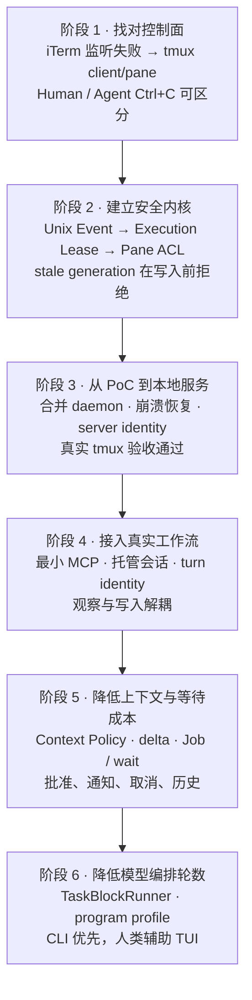

# Shared Terminal Bridge（九）：从 PoC 到可用工具，十五轮实操如何驱动架构收敛

> **系列导航**：[系列目录](../README.md) · 上一篇：[Shared Terminal Bridge（八）：从 Codex MCP 到 ChatGPT STB-RDC](08-codex-mcp-to-chatgpt-stb-rdc.md) · 下一篇：[Shared Terminal Bridge（十）：当前架构、性能账本与下一阶段路线图](10-current-architecture-roadmap.md)
> **系列定位**：本文是《Shared Terminal Bridge：人与 AI 共用真实终端的演进记录》第 9 篇。上一篇讲清了 Codex MCP 与 ChatGPT STB-RDC 如何汇入同一个安全内核；这一篇回到工程过程，复盘 STB 从第一版 PoC 到第 15 轮真实运维验证的收敛路径。重点不是版本清单，而是每个问题怎样迫使架构改变，以及哪些变化真的改善了耗时、Token 和人的注意力成本。
上一篇：[Shared Terminal Bridge（八）：从 Codex MCP 到 ChatGPT STB-RDC](08-codex-mcp-to-chatgpt-stb-rdc.md)
历史原始记录：[Notion 页面](https://app.notion.com/p/3e247b2dd14581589c65d3c6db70a317)

## 两条演进线：安全正确，与交互高效

STB 的迭代并非一条直线。它同时解决两类性质不同的问题：

1. **安全线**：谁在输入、当前写入是否仍被授权、Human Ctrl+C 能否撤销模型已规划但尚未落地的动作。
2. **效率线**：终端历史怎样进入上下文、长任务怎样等待、复杂检查怎样减少模型往返、TUI 怎样避免吞噬 Token。
安全线先成熟，效率线随后在真实运维中反复打磨。若只看最终 API，很容易低估中间那些看似“能工作”却不适合日常使用的阶段。




可编辑 Mermaid 源文件：[09-fifteen-iteration-timeline.mmd](https://github.com/sharpbai/notion-assets/blob/main/tech/shared-terminal-bridge/09-fifteen-iteration-timeline.mmd)

## 第一阶段：先承认控制面不是 iTerm2

最早的 PoC 试图通过 iTerm2 Python API 观察按键。它很快暴露出根本问题：需要额外启用 API、窗口生命周期不稳定、会弹出新窗口，而且若退化成全局键盘监听，就无法证明一个 Ctrl+C 属于哪一个交互终端。
真正被人与模型共同操作的对象不是 iTerm2，而是 tmux session 与 pane。转向 tmux 后，来源分流变得天然可验证：

- 真人 Ctrl+C 从 tmux client key table 进入；
- Agent 的 `tmux send-keys C-c` 直接写入 pane；
- 事件能够携带 pane ID 与 client TTY；
- 不需要 macOS 全局键盘监听。
第一个关键原则由此形成：

> **控制和授权必须绑定 tmux 的 client、session 与 pane，而不是某个 Terminal 模拟器窗口。**

## 第二阶段：Human Event 只解决“知道发生了什么”

文件日志 PoC 证明来源可分后，事件通道改成权限为 0600 的 Unix domain socket。结构化事件包含 seq、source、key、session、pane、client 和 timestamp。
这一层实现了两个重要语义：

- listener 不在线时，真人 Ctrl+C 仍应立即到达前台程序，即 Human path fail-open；
- Agent Ctrl+C 不能伪装成 Human Override。
但事件本身只能告诉系统“人按下了 Ctrl+C”，不能阻止模型此前已经决定、尚未发出的下一条命令。因此下一步不是增加更多监听，而是建立执行权模型。

## 第三阶段：Execution Lease 把中断变成撤销权

Execution Lease 以 `pane + generation + state` 表示某一轮模型动作的执行权。真人 Ctrl+C 将当前 generation 从 ACTIVE 变为 REVOKED；所有 Agent 写入在进入 pane 前必须携带并通过 generation 校验。
首次 PoC 验证了：

- generation 1 的正常动作可以进入 pane；
- Agent Ctrl+C 不撤销 lease；
- Human Ctrl+C 产生 Human Override；
- 已撤销的 generation 1 后续动作被拒绝，且没有到达 pane。
这不是“人按 Ctrl+C 后永久禁止模型操作”。它表达的是：

> **人的否决会使当前决策链失效；下一条真实用户消息可以开启新 turn，并获得新的 generation。**
后续把授权身份从模糊时间判断收敛为 `thread_id + turn_id + turn_started_at_ms`。时间戳严格单增，唯一 turn ID 防止同毫秒碰撞和回放；只有新的 UserMessage 才能在 Override 后重新 acquire。

## 第四阶段：把安全 PoC 变成本地状态服务

随后 Observation、Human Event、Execution Lease、Pane ACL 和 Action Guard 被合并到一个本地 daemon。此阶段的重点不是增加功能，而是处理长期运行中的身份与恢复：

- 未授权 pane 的读写都被拒绝；
- 未知 client 不回退到含糊的“当前 pane”；
- tmux Ctrl+C binding 可精确备份与恢复；
- daemon 被 SIGKILL 后，ACTIVE lease 在恢复时自动变为 REVOKED；
- generation 保持单调，状态文件权限为 0600；
- 单实例锁阻止两个 daemon 同时拥有状态；
- tmux server UUID 阻止 pane ID 被新 server 复用后继承旧授权。
合并 daemon 完成 14 项检查，真实日常 tmux 验收又通过 9 项。到这里，安全内核才算从实验进入可复用状态。

## 第五阶段：最小 MCP 与托管会话

最小 stdio MCP 只做协议适配，真正的状态仍由 Unix socket 后的 Bridge daemon 持有。初版默认发布只读 Observation tools，写入能力必须显式启用。
随后补齐托管会话：

- `stb create/enter/list/info/stop`；
- 创建时设置 100,000 行历史和鼠标；
- MCP 创建交互会话后，人可以一键进入同一个 tmux；
- lease、approval、job 与历史可以由本地命令管理。
这里也出现了第一次“代码可用、模型却用不到”的问题。实操 05 中 MCP 已初始化，但工具采用 deferred discovery，模型没有搜索目录便误报“没有可用工具”。修复不是把所有工具永久塞进上下文，而是加入精确 routing Skill：遇到 STB 请求才查找对应工具；只有搜索与连接均失败时，才报告不可用。

## 实操 03：安全语义成立，但成本仍然很高

“检查 local-33 磁盘占用03”第一次完整走通日常链路：新 task 获取 generation、执行检查、真人 Ctrl+C、Agent 立即停止后续写入并返回已有信息、后续用户消息取得新 generation、人在共享终端授予 root 后继续只读分析。

<table fit-page-width="true" header-row="true">
<tr>
<td>指标</td>
<td>实操 03</td>
</tr>
<tr>
<td>总耗时</td>
<td>255.505 秒</td>
</tr>
<tr>
<td>MCP 调用</td>
<td>25 次</td>
</tr>
<tr>
<td>Input token</td>
<td>1,344,659</td>
</tr>
<tr>
<td>Bridge RPC</td>
<td>通常 10–30 ms</td>
</tr>
</table>
数据说明瓶颈并不在 Unix socket，而在模型采样、审批、短轮询和整段终端历史反复进入上下文。这一轮直接推动了 AI Context Policy 与 Task Block。

## 实操 04–07：减少垃圾上下文，也停止假设目标环境

API v2 引入 `terminal_read_delta`、opaque cursor、行数/字节预算、ANSI 清理、重复折叠以及 Task Block 元数据。实操 04 随即暴露 daemon 与 MCP 版本不同步，于是加入 `bridge_info`、API 协商和明确的 `BRIDGE_RESTART_REQUIRED`。
更重要的教训来自一次临时脚本失败：本机生成的 `/var/folders/.../stb-task-....sh` 被要求在远端 shell 执行。这个设计把本地文件系统假设泄漏到了目标环境。
因此 Task Block 最终固定为：

- 只在本地记录计划、generation 与观察起点；
- 不注入 wrapper、marker、临时脚本或隐藏 TTY 协议；
- 实际命令必须在共享终端中显式可见；
- 目标环境的大文件或特殊 I/O 使用其明确支持的标准命令。
实操 06 又暴露“只想看历史却 acquire 失败”的问题。由此把 Observation 与 Execution 彻底解耦：读 history/state 不需要 lease，只有 Agent 写入才需要授权。实操 07 的交互已明显顺畅，也验证了这条边界。

## 实操 08–12：人的批准、注意力与取消都成为一等状态

实操 08 中，长命令需要批准，却没有给用户可操作的完整提示。调整后，批准流程变成结构化 request：显示完整命令、预计耗时、资源影响与预算；approval 与命令 SHA-256、pane、generation 和 request 绑定，并保留 `stb approvals/approve/reject` 管理入口。
实操 09–10 暴露长任务的另一面：命令发出后，人不知道何时完成；而固定轮询既消耗 Token，又可能在用户中断等待后继续阻塞新消息。
API v5–v6 因此加入 Terminal Job 与事件驱动等待：

- submit 快速返回 `job_id`；
- Bridge 在本地等待终态，不用模型短轮询；
- 完成、Human Override、交互提示或错误时提前唤醒；
- 10 分钟仍无结论时返回 `STRATEGY_REVIEW_REQUIRED`；
- MCP cancellation 只取消“模型的等待”，不终止目标命令；
- 新用户消息不再被旧 wait 阻塞；
- 状态变化可以通过系统通知归还人的注意力。
实操 11 的主观反馈是“明显感觉好用多了”；实操 12 没有明显错误，剩余问题集中为速度。这标志着系统从“偶尔能完成”进入“交互结构基本正确”。

## 实操 13：功能稳定后，65 次提交暴露编排成本

持久历史加入后，tmux 与 STB 的动作、generation、状态和脱敏命令摘要可以用于复盘。但实操 13 虽然流畅，复杂任务仍产生 65 次 command submit。
瓶颈已经不是安全层，而是模型被迫在大量确定性步骤之间反复醒来。该轮促成四个 P0 修复：

- 提示检测只看当前 job，而不是旧 scrollback；
- 同一 turn acquire 幂等；
- wait 终态直接携带 bounded output，避免追加 status；
- 本地命令 lint 拒绝未闭合引号等明显错误。
同时新增 API v8 的只读 TaskBlockRunner：一次声明 1–8 个确定性只读步骤，由 Bridge 本地逐步调度。每步仍是可见命令、独立 job、独立审计，并持续执行 generation 校验；Human Ctrl+C、交互提示、断言失败或上下文变化都会立即停止。
它不是“一次模型调用只能执行一条命令”的绕过，而是把无需新语义判断的步骤留在本地，把模型调用保留给真正的决策边界。

## 实操 14：普通命令变便宜后，TUI 成为压倒性成本

Runner 对普通首检有效：

<table fit-page-width="true" header-row="true">
<tr>
<td>指标</td>
<td>实操 13</td>
<td>实操 14</td>
<td>变化</td>
</tr>
<tr>
<td>首检耗时</td>
<td>30.661s</td>
<td>28.471s</td>
<td>-7.1%</td>
</tr>
<tr>
<td>首检 Input</td>
<td>247,452</td>
<td>172,781</td>
<td>-30.2%</td>
</tr>
</table>
但 TestDisk 的 TUI 操作产生了 91 次按键、26 次整屏读取、878.9 秒和 14.303M input，约占整段会话 input 的 64%。退出全屏后还出现 ncurses alternate screen 或 TTY 模式未完全恢复导致的对齐异常。
这说明通用 TUI 自动化不是当前值得重投入的方向。策略改为：

```text
程序原生 CLI / CMD / batch
        ↓
人类辅助 TUI 到明确检查点
        ↓
Agent 轻量、受限 TUI fallback

```

API v9 增加本地 `terminal_program_profile`，首批覆盖 TestDisk 与 PhotoRec；Runner 只为可证明只读的精确模板放行，不把整个程序笼统标成安全。

## 实操 15：日常可用，但冷启动仍由模型主导

实操 15 完成多轮磁盘分析、长扫描、精确删除和删除后验证，没有出现 TUI、Human Override、lease 冲突、Runner 拒绝、MCP 错误、空增量轮询或等待阻塞。

<table fit-page-width="true" header-row="true">
<tr>
<td>指标</td>
<td>实操 14</td>
<td>实操 15</td>
<td>变化</td>
</tr>
<tr>
<td>活跃时间</td>
<td>1,743.958s</td>
<td>604.434s</td>
<td>-65.3%</td>
</tr>
<tr>
<td>Input token</td>
<td>22.439M</td>
<td>4.727M</td>
<td>-78.9%</td>
</tr>
<tr>
<td>非缓存 Input</td>
<td>478,749</td>
<td>85,156</td>
<td>-82.2%</td>
</tr>
<tr>
<td>TUI 按键 / 整屏读取</td>
<td>91 / 26</td>
<td>0 / 0</td>
<td>-100%</td>
</tr>
</table>
这些会话的任务范围不完全相同，不能把全部降幅归因于某一项代码改动。但最大变量很清楚：**避开 TUI 带来的收益远大于微调 socket 或单次 RPC。**
普通首检却没有同步变快：实操 15 为 42.756 秒、171,482 input，相比实操 14 的 28.471 秒、172,781 input，Token 基本持平而耗时增加约 50%。其中 Bridge 工具只占约 7.2 秒，其余主要来自模型首 Token、工具发现和编排。
所以当前性能结论是：

> **控制面已经足够快；下一阶段应减少模型决策边界和冷启动上下文，而不是继续优化 Unix socket。**

## 那些被真实会话淘汰的设计

<table fit-page-width="true" header-row="true">
<tr>
<td>曾经的方向</td>
<td>为什么不成立</td>
<td>收敛后的做法</td>
</tr>
<tr>
<td>监听 iTerm2 或全局键盘</td>
<td>无法稳定绑定共享 pane，边界过宽</td>
<td>tmux client/pane 是唯一控制面</td>
</tr>
<tr>
<td>从屏幕上的 `^C` 推断人工中断</td>
<td>回显不是可信来源</td>
<td>Human Event 来自 tmux client key path</td>
</tr>
<tr>
<td>布尔“已授权”</td>
<td>无法撤销已规划的后续动作</td>
<td>generation + stale write denial</td>
</tr>
<tr>
<td>向目标注入脚本与 marker</td>
<td>假设文件系统、shell 和远端环境</td>
<td>本地元数据，显式终端命令</td>
</tr>
<tr>
<td>每次读取完整 scrollback</td>
<td>上下文重复、旧提示污染</td>
<td>有界 delta + current-job scope</td>
</tr>
<tr>
<td>短周期模型轮询</td>
<td>浪费 Token 和人的注意力</td>
<td>本地 job wait + event cancellation</td>
</tr>
<tr>
<td>通用 TUI 自动化</td>
<td>整屏读取和逐键决策成本失控</td>
<td>CLI 优先，人类检查点，Agent fallback</td>
</tr>
</table>

## 从十五轮实操提炼出的工程原则

1. **真实 tmux 是事实来源。** 终端显示、前台进程和人的输入都必须在同一个 pane 中成立。
2. **安全约束由本地服务强制。** 提示词解释意图，generation 决定写入是否能发生。
3. **观察不等于执行。** 看历史、读状态无需抢占 lease。
4. **Human Override 是撤销当前决策链。** 后续真实用户消息通过新 generation 继续。
5. **不假设目标执行环境。** 不注入脚本、wrapper、隐藏协议或本机路径。
6. **上下文在进入模型前治理。** 完整历史留在本地，模型只消费预算内的增量与摘要。
7. **模型只停在语义边界。** 确定性只读步骤本地运行，需要判断时再回到模型。
8. **等待是一种本地状态。** 完成、取消、提醒和策略复核不应依赖 Token 轮询。
9. **TUI 是最后手段。** 先找程序原生 CLI，再让人协作到检查点。
10. **实操基线本身就是规格。** 每次“感觉更顺”都要能回到事件、调用次数、耗时和 Token 解释。

## 当前稳定边界

截至这一阶段，STB 已经稳定支持：

- Human 与 Agent 输入来源分流；
- pane-scoped Execution Lease 与 stale generation 拒绝；
- 后续用户消息重新授权；
- Observation 与写入权限解耦；
- 长命令结构化批准、Job、事件等待与取消；
- AI Context Policy、有界 delta 与持久交互历史；
- 只读 TaskBlockRunner；
- CLI/CMD/batch 优先的程序能力画像；
- Codex MCP 与 ChatGPT STB-RDC 共用同一个本地安全内核。
仍未完成的方向包括：写入步骤与只读验证块的组合、持久 Task Block 恢复、本地 loop/stuck detection、远程断线恢复基线、多 client/nested tmux 场景，以及更轻量的 TUI 生命周期保护。

## 结语

STB 的成熟不是功能不断叠加，而是持续移除错误假设：不再假设 iTerm2 是控制面，不再假设屏幕回显能证明人的意图，不再假设目标环境拥有本机临时文件，也不再假设模型必须参与每一次轮询和按键。
从 PoC 到第 15 轮实操，架构最终收敛到一个简单分工：

> **tmux 保存真实交互，本地 Bridge 强制安全与状态，模型负责语义决策，人保留随时撤销和接管的最高权力。**
下一篇将从迭代史回到当前系统，整理 STB 的架构账本、Token/时间成本分布，以及下一阶段真正值得投入的优化路线。
