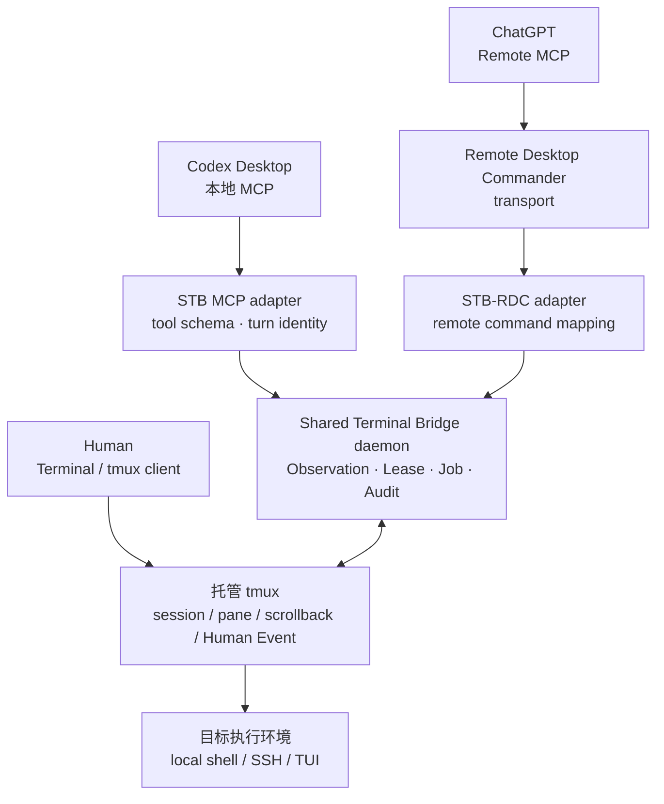

# Shared Terminal Bridge（十）：当前架构、性能账本与下一阶段路线图

> **系列导航**：[系列目录](../README.md) · 上一篇：[Shared Terminal Bridge（九）：从 PoC 到可用工具，十五轮实操如何驱动架构收敛](09-fifteen-iterations.md)
> **系列定位**：本文是《Shared Terminal Bridge：人与 AI 共用真实终端的演进记录》第 10 篇，也是 `v0.14.0 / API v9` 的阶段性架构快照。前九篇分别解释了问题来源、安全模型、上下文治理、长任务、Task Block、TUI 选路、STB-RDC 和十五轮实操演进；本文把这些内容收敛为一份当前架构、性能账本与下一阶段路线图。
上一篇：[Shared Terminal Bridge（九）：从 PoC 到可用工具，十五轮实操如何驱动架构收敛](09-fifteen-iterations.md)

## 快照信息

<table fit-page-width="true" header-row="true">
<tr>
<td>项目状态</td>
<td>固化值</td>
</tr>
<tr>
<td>Bridge / MCP 版本</td>
<td>`v0.14.0`</td>
</tr>
<tr>
<td>Bridge API</td>
<td>v9</td>
</tr>
<tr>
<td>Git 提交</td>
<td>`c2f84bee7b2f0bb6325a1519a94aa8bd656726b6`</td>
</tr>
<tr>
<td>Git 标签</td>
<td>`v0.14.0`</td>
</tr>
<tr>
<td>自动回归</td>
<td>67 项通过</td>
</tr>
<tr>
<td>成熟度判断</td>
<td>本地日常使用稳定，仍不是通用远程终端平台</td>
</tr>
</table>
这份快照的重要意义是：后续优化可以明确地与 `v0.14.0` 比较，不再把正在变化的工作树当成基线。

## 当前架构：一个事实层，两个 AI 入口

[Mermaid 源文件](https://github.com/sharpbai/notion-assets/blob/main/tech/shared-terminal-bridge/10-current-architecture.mmd) · [SVG](https://raw.githubusercontent.com/sharpbai/notion-assets/main/tech/shared-terminal-bridge/10-current-architecture.svg) · [PNG](https://raw.githubusercontent.com/sharpbai/notion-assets/main/tech/shared-terminal-bridge/10-current-architecture.png)
架构的核心不是“Codex 如何控制 shell”，而是三个所有权判断：

- **tmux 拥有终端事实**：真实屏幕、scrollback、前台进程和人的键盘输入都在 pane 中发生。
- **Bridge 拥有执行状态**：ACL、Lease、generation、approval、Job、等待、审计和恢复均在本地 daemon。
- **模型拥有语义决策**：理解目标、选择方案、判断异常、请求批准和组织最终结论。
Codex MCP 与 ChatGPT STB-RDC 只是两种入口。它们不能各自维护另一套 lease、job 或 Human Override，否则同一个 pane 会出现两个彼此不知道的控制状态。

## Bridge 内部的四个职责域

### Observation：读事实，但不取得执行权

Observation 负责 pane discovery、Pane ACL、`capture-pane`、有界读取与 AI Context Policy。它只回答“终端现在是什么状态”，不代表 Agent 可以输入。
关键边界：

- `terminal_read`、`terminal_read_delta`、`terminal_state` 不需要 lease；
- 完整 scrollback 保留在本地，默认只返回 cursor delta；
- 默认预算 200 行、16 KiB，硬上限 1000 行、64 KiB；
- ANSI、控制字符、回显和重复行在进入模型前确定性处理；
- Human Override、lease state 等控制事件保持结构化，不交给自然语言摘要猜测。

### Execution Control：决定一条写入是否仍然有效

写入授权绑定 `thread_id + turn_id + turn_started_at_ms + pane + generation`。每次动作在进入 pane 之前重新校验。
Human Ctrl+C 的固定语义是：撤销当前 generation，而不是普通命令失败。旧 generation 的剩余动作一律拒绝；后续真实用户消息可以取得新 generation，继续新的决策链。
长任务批准进一步绑定 request、完整命令摘要、命令 SHA-256、pane、generation 与预算。批准不是一张长期通行证，而是只能消费一次的具体授权。

### Job Runtime：把等待和确定性步骤留在本地

每次 `terminal_submit` 创建 Job。Bridge 本地负责等待、活动证据、提示符回归、交互提示和取消：

- 普通路径为 `submit + wait`；
- 默认等待可持续 10 分钟，不需要模型短轮询；
- MCP 取消只唤醒等待，不向终端发送 Ctrl+C；
- 10 分钟无结论进入 `STRATEGY_REVIEW_REQUIRED`；
- 明显超出合理预期进入 `HUMAN_DECISION_REQUIRED`；
- 完成结果附带有界输出，正常情况不再追加 status。
TaskBlockRunner 位于同一层。它一次执行 1–8 条确定性只读步骤，但每一步仍是可见命令、独立 Job、独立审计和独立 generation 校验。Runner 不是目标环境里的脚本，也不会注入 wrapper 或 marker。

### Audit & Recovery：让状态能复盘，也能安全失效

Bridge 持久记录租约、审批、提交、Job 状态、Human/Agent 中断与有界输出摘要，文件权限为 0600。密码输入不落盘，明显的 password/token/secret 赋值会整体脱敏。
恢复策略坚持 fail closed：

- daemon 异常退出后 ACTIVE lease 自动变为 REVOKED；
- generation 单调递增；
- 单实例锁避免双 daemon；
- tmux server UUID 防止 pane ID 复用继承旧授权；
- binding 有快照才恢复，无快照不做猜测。

## 四条不能为效率让路的硬边界

1. **Observation 不需要 lease，Execution 必须有 lease。** 看历史不能抢占或释放别人的写权。
2. **stale generation 在写入前拒绝。** 不能先发送再用日志解释。
3. **不向目标环境注入内部实现。** 不发送本地临时脚本、wrapper、marker、TTY 配置或隐藏协议。
4. **Human Ctrl+C 拥有最高优先级。** Override 后当前 turn 最多再读取一次已有信息，不重新 acquire，不继续写入。
这四条定义了 STB 与普通“Agent shell tool”的本质区别。

## 性能账本：时间和 Token 花在哪里

STB 的性能不能只看 Unix socket 延迟，也不能只看总 Token。至少要分为四类成本：

<table fit-page-width="true" header-row="true">
<tr>
<td>成本层</td>
<td>典型内容</td>
<td>是否主要消耗模型用量</td>
<td>当前判断</td>
</tr>
<tr>
<td>本地控制面</td>
<td>Unix socket、tmux、lease 校验、JSONL、Job wait</td>
<td>本身通常不消耗模型 Token</td>
<td>通常毫秒级，不是主要瓶颈</td>
</tr>
<tr>
<td>工具观察</td>
<td>工具 schema、终端输出、历史、状态对象</td>
<td>返回模型后成为输入上下文</td>
<td>必须用 delta、预算和摘要约束</td>
</tr>
<tr>
<td>模型编排</td>
<td>规划、每步判断、重新采样、工具发现</td>
<td>是</td>
<td>普通首检的主要延迟来源</td>
</tr>
<tr>
<td>TUI 视觉循环</td>
<td>整屏读取、按键、再判断</td>
<td>高频、大输入、强依赖模型</td>
<td>当前最大的失控风险</td>
</tr>
</table>
需要注意：本地等待期间 Bridge 和终端进程继续运行，但模型没有被反复调用；等状态变化后一次返回，才形成新的模型输入。系统通知和 `stb watch` 也可以把注意力交还给人，而不必让模型持续轮询。
工具调用本身不能简单归类为“算 Token”或“不算 Token”。更准确的说法是：

- 本地函数执行、tmux 等待和 daemon 状态机不是语言模型推理；
- 工具说明、调用参数和返回内容进入下一次模型调用时，会增加上下文；
- 输出越大、调用轮数越多，通常越容易增加输入量与采样延迟；
- 高缓存比例能降低重复输入的边际成本，但不会消除模型调用次数和等待时间；
- Codex 产品的周用量口径由产品侧决定，STB 只能通过减少模型往返和上下文体积间接优化。

## 三个实操基线告诉了什么

<table fit-page-width="true" header-row="true">
<tr>
<td>基线</td>
<td>关键数据</td>
<td>主要结论</td>
</tr>
<tr>
<td>实操 03</td>
<td>255.505s；25 MCP；1.345M input</td>
<td>安全链路正确，但整段上下文、审批与轮询昂贵</td>
</tr>
<tr>
<td>实操 13</td>
<td>65 次 submit；Input 25.034M，缓存约 98.8%</td>
<td>复杂任务被切得过碎；缓存没有消除编排延迟</td>
</tr>
<tr>
<td>实操 14</td>
<td>TestDisk：91 次按键、26 次整屏读取、14.303M input</td>
<td>TUI 占整段 input 约 64%，远大于普通控制面成本</td>
</tr>
<tr>
<td>实操 15</td>
<td>604.434s；49 MCP；4.727M input；无 TUI</td>
<td>较 14 整体 input -78.9%，主要收益来自避开 TUI</td>
</tr>
</table>
这些数据的任务范围不同，不能当作严格 A/B 实验。但它们共同指向稳定结论：

> **最值得优化的是模型被唤醒的次数和每次看到的内容，而不是 Bridge 单次 RPC 的微小延迟。**

## 普通首检为什么还没有明显变快

实操 14 的普通首检为 28.471 秒、172,781 input；实操 15 为 42.756 秒、171,482 input。Input 基本持平，时间反而增加 50.2%。实操 15 的 Bridge 工具执行只占约 7.2 秒，其余约 35.5 秒来自首 Token、工具发现与模型编排。
因此，下一阶段若继续优化 `capture-pane` 或 socket，收益很有限。应优先处理：

- 新 task 的工具发现与 Skill 冷启动；
- 同一固定工作流中的重复上下文；
- 能在一次 Runner 中完成、却被拆成多次模型判断的只读检查；
- wait 已返回完整结果后仍追加 status；
- 没有业务价值的中间自然语言回合。

## 当前已经适合做什么

`v0.14.0` 适合以下日常工作：

- 人与 AI 在同一个托管 tmux 中协作；
- 本地 shell 或已由人建立的 SSH 会话；
- 有明确命令的检查、诊断和分阶段修改；
- Human Ctrl+C 后立即撤销当前模型执行权；
- 高 I/O 或长扫描的显式批准、后台等待与通知；
- 多个确定性只读步骤的本地 Runner；
- 精确写入后使用独立只读步骤验证；
- Codex 与 ChatGPT 从不同入口调用同一个本地安全内核。

## 当前不试图解决什么

- 不把 STB 做成 Web Terminal 或通用远程桌面。
- 不证明 tmux client 背后真人的操作系统身份。
- 不自动获得 sudo、密码或目标系统权限。
- 不把任意 shell 脚本标成“只读”。
- 不建设重型、通用的 TUI 自动驾驶。
- 不承诺 daemon 重启后恢复所有运行中 Task Block。
- 不保证所有 SSH 断线、nested tmux、多 client 竞争已经完成真实验收。
明确“不做什么”是当前可用性的组成部分：它限制了系统需要猜测的空间。

## 下一阶段路线图

### P0：直接降低普通任务的模型成本

1. **冷启动最短路径**：让已知会话的常规任务直接进入 acquire + Runner，减少重复工具搜索与完整 Skill 读取。
2. **严格收口 ****`submit + wait`**：`output_complete=true` 后禁止多余 status；真正长任务采用默认 10 分钟本地等待。
3. **写入后验证块**：修改步骤仍单独批准与执行，成功后允许预声明的只读验证步骤本地连续完成。
4. **本地 stuck detection**：检测相同命令/结果、相同错误、连续空增量与无实质进展，在浪费模型回合前返回 `NEEDS_REPLAN`。
5. **分类型性能基线**：固定“普通首检、长扫描、写入+验证、TUI”四类，不再只比较整段会话总量。

### P1：提升长任务与异常恢复的确定性

1. 持久化 Task Block checkpoint，使用 `task_block_id + step_id + generation` 保证幂等。
2. 完成 SSH Broken pipe、前台程序变化、wait 取消与 daemon restart 的真实验收矩阵。
3. 用同主机、同文件系统、同命令类别的历史 Job 改善耗时估计，但不取消 high I/O 的人工批准。
4. 将审计引用与大输出分离：模型看到摘要和 evidence reference，人可按需查看原始本地历史。
5. 为 Codex MCP 与 STB-RDC 建立同一套契约测试，确保 transport 不改变安全语义。

### P2：扩展边界，但不扩大默认授权

1. 多 client 同 pane、nested tmux 与复杂 SSH 链路的身份解析。
2. Human Event 的重连、事件 replay 与 consumer acknowledgement。
3. 轻量 TUI 生命周期保护：expected process、screen fingerprint、changed rows 与退出后 TTY 检查。
4. 命令事件增强：command start/exit、exit code、cwd、host 与输出区间关联。
5. 审计可观测性与秘密保护的进一步平衡。

## 路线图的优先级判断方法

后续功能不以“自动化程度更高”为默认目标，而用四个问题排序：

1. 是否减少模型不必要的决策轮数？
2. 是否降低进入模型的垃圾上下文？
3. 是否保持 Human Override 与 generation 校验不被绕过？
4. 是否对目标环境引入新的隐含假设？
只有前三项有明确收益、第四项答案为否，才值得进入近期实现。

## 如何判断下一版真的更好

每次版本迭代至少记录：

- 用户回合数、模型采样点和 MCP 调用分布；
- Input、非缓存 Input、Output 与 reasoning output；
- 首 Token、工具执行和总活跃时间；
- submit、wait、status、Runner、批准和 Human Override 次数；
- 空增量、重复命令、TUI 按键和整屏读取；
- 用户是否需要一直盯着终端；
- 是否出现越过 generation、错误恢复或目标环境假设。
“感觉顺畅”很重要，但它需要与这些记录相互印证。STB 的目标不是让 benchmark 数字漂亮，而是让人可以安全地把一部分注意力交给模型，同时随时夺回执行权。

## 结语

`v0.14.0` 已经完成了最困难的架构收敛：

- 真实交互属于 tmux；
- 安全状态属于本地 Bridge；
- 语义决策属于模型；
- 最终否决权属于人。
后续工作的重点不再是证明“AI 能不能向终端发命令”，而是让每一次模型介入都值得：少看垃圾、少做轮询、少在确定性步骤之间反复醒来，并在任何时刻尊重人的中断与新的决定。
这也构成 STB 下一阶段最清晰的产品定义：

> **它不是一个替人操作终端的 Agent，而是一层让人和 Agent 能在同一个真实终端中安全、低成本协作的本地控制协议。**
