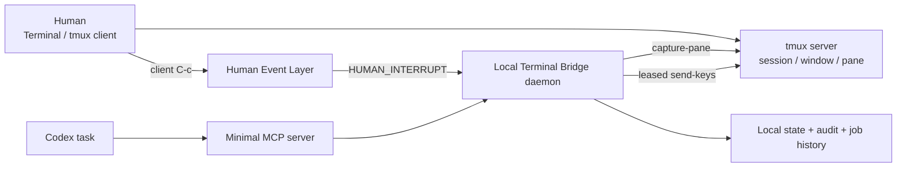
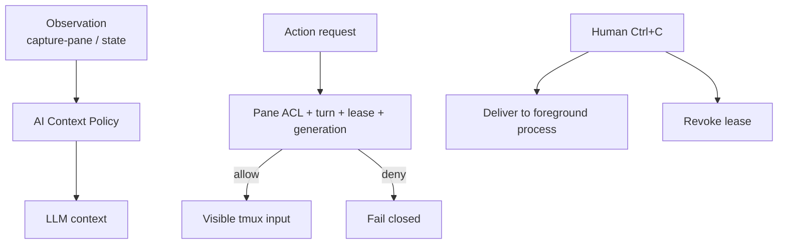

# Shared Terminal Bridge：人与 Codex 共用 tmux 的交互式运维架构与实测

> **一句话总结**：Shared Terminal Bridge 是一个本地优先、Human-first 的 tmux sidecar。人和 Codex 共用同一个真实终端，模型默认只读；只有获得当前用户回合授权后才能写入。真人按下 Ctrl+C 会立即撤销模型的 execution lease，旧决策不能继续落到终端。
版本演进详见：[Shared Terminal Bridge 迭代史：从 Ctrl+C PoC 到 API v9](stb-iteration-history-api-v9.md)
<table_of_contents/>

# 项目背景与目标

传统的 AI 终端通常试图重新包装 Shell，或者让用户把输出复制到聊天中。本项目选择了另一条路线：

- 用户继续使用自己的 Terminal、SSH、tmux 和原有工作习惯。
- tmux pane 是 Human 与 Codex 共享的事实来源。
- Codex 作为本地 sidecar，按需读取同一个 pane 的历史和状态。
- 写入能力晚于观察能力，并且受到 pane ACL、用户回合、execution lease 和 generation 的共同约束。
- Human 操作永远高于 Agent；Bridge 不接管终端，也不假设目标环境。
项目代码位于本机：

```text
/Users/sharpbai/Documents/ChatGPT/IT网管/shared-terminal-bridge

```

当前版本：**Bridge/MCP v0.14.0，API v9**。

# 整体架构



## 核心组件

1. **tmux server**
	- 保存真实 session、window、pane 和 10 万行 scrollback。
	- 人类输入经过 tmux client key table。
	- Agent 输入通过 Bridge 的 `send-keys` 进入 pane。

2. **Local Bridge daemon**
	- Unix socket JSON API。
	- 管理 pane ACL、execution lease、generation、Human Override、job、等待和持久状态。
	- 所有真正的安全拒绝都发生在本地服务中，而不是依靠提示词。

3. **Human Event Layer**
	- 在 tmux client 输入层监听 Ctrl+C。
	- 先把 Ctrl+C 原样送到前台进程，再异步发布结构化事件。
	- consumer 断开或日志失败时保持 fail-open，不影响人类中断程序。

4. **Minimal MCP server**
	- 向 Codex 暴露受限观察和操作工具。
	- 默认只读，Action 需要显式启用。
	- 负责 Codex thread/turn 与 Bridge lease 的可信衔接。
	- 根据 Bridge API 版本动态发布工具，旧 daemon fail closed。

5. **stb 管理命令**
	- 创建、进入、查看和停止托管 tmux。
	- 管理 lease、长任务批准、job、wait 和历史。
	- 示例：`stb create verify33`、`stb enter verify33`、`stb jobs`、`stb history verify33`。

# 最关键的安全模型

## Human 与 Agent 输入来源分流

来源判定发生在 tmux，而不是 iTerm2 或 macOS 全局键盘监听：

```text
Human keyboard → tmux client → root key table → pane
Agent         → Bridge → tmux send-keys → pane

```

真人 Ctrl+C 会命中 tmux root binding；Agent 的 `send-keys C-c` 直接进入 pane，不经过 client key table，因此不会伪装成 Human Override。
这项机制已经实测验证：

- 真人 Ctrl+C：前台程序正常停止，并产生 `HUMAN_INTERRUPT`。
- Agent Ctrl+C：停止程序，但不会产生 Human 事件。
- 事件可精确关联 `server/session/pane/client/seq/timestamp`。
- 监听器不运行时，Ctrl+C 仍立即生效。

## Execution Lease 与 generation

每次 Codex 获得写权限时，Bridge 为具体 pane 创建 lease：

```json
{
  "pane": "%1",
  "generation": 13,
  "state": "ACTIVE",
  "authorization": {
    "thread_id": "...",
    "turn_id": "...",
    "turn_started_at_ms": 1790001613842
  }
}

```

所有写操作必须携带同一 pane 的有效 generation。
状态机：

```text
ACTIVE
 ├─ 正常释放       → RELEASED
 ├─ daemon 重启    → REVOKED
 └─ HUMAN_INTERRUPT → REVOKED

```

真人 Ctrl+C 的语义不是“命令失败后重试”，而是：

> 当前用户回合授权给模型的执行权已经撤销。
因此，Human Override 后：

1. 当前命令由真人正常中断。
2. Bridge 拒绝旧 generation 的任何后续写入。
3. 模型最多读取一次已有结果。
4. 本轮立即结束，不自动重试或继续计划。
5. 后续真实用户消息到达后，才能基于新的 turn 获取新 generation。
这解决了“模型已经决定执行下一步，但用户在决策之后按下 Ctrl+C”的竞态：旧决策在到达 pane 前会被 generation 校验拒绝。

## Pane ACL 与身份隔离

- 授权绑定具体 pane，不扩大到整个 tmux server。
- 未授权 pane 可以被枚举，但读取和写入均 fail closed。
- active pane 按明确 client 解析，不使用模糊的全局 current pane。
- daemon 使用单实例文件锁。
- tmux server 有持久 UUID，防止新 server 复用旧 pane ID 和旧授权。
- tmux server 消失时，旧 Bridge state 会归档，不会绑定到新 server。

# 数据通道、控制通道与故障边界



- **数据通道**：`capture-pane`、state、job output。
- **Agent 写入通道**：显式命令或按键，经 lease 校验后发送。
- **Human 控制通道**：tmux client event。
- **管理通道**：本机 `stb`，用于会话、批准、job 和历史管理。
故障原则：

- Bridge 崩溃不能阻止人继续使用 tmux。
- Human 事件发布失败不能阻止 Ctrl+C。
- daemon 重启时 ACTIVE lease 全部撤销。
- 未识别的 server、pane、generation、method 或 API 版本一律 fail closed。
- 不记录普通人类按键、密码或 Token。

# AI Context Policy：先阻止垃圾进入上下文

项目没有只依赖模型自身压缩，而是在 Bridge 层做确定性 admission control。

## 五层上下文

1. **Raw pane history**：完整事实留在 tmux 本地。
2. **Observation cursor**：后续只返回上次 snapshot 之后的 suffix delta。
3. **Deterministic filter**：去除 ANSI/control、命令回显和重复行。
4. **Context budget**：默认 200 行、16 KiB；硬上限 1000 行、64 KiB。
5. **Structured control fields**：Human Override、lease、job state 不经过自然语言摘要。
超限输出保留开头、最新内容和省略统计，不把完整 scrollback 反复塞进模型。
观察不需要 lease。即使另一个 Codex task 持有 ACTIVE lease，人仍可滚屏，其他任务也可以只读查看历史；写入仍由 generation 串行化。

# 命令执行模型

## terminal_task_block：只记录、不执行

早期设想是把多条命令作为脚本注入目标环境。实测后否决了这个方向，因为它会：

- 假设目标端存在某种 shell、临时目录和执行能力；
- 引入 wrapper、marker、临时文件或隐藏协议；
- 让人难以在共享终端中判断实际执行内容；
- 增加远程主机、容器、root shell 和异常退出时的不确定性。
现在 `terminal_task_block` 只记录计划、generation 和观察起点，不向 pane 写任何字节。

## terminal_submit：显式可见的单条命令

每条真正执行的命令必须作为原始文本显式提交，并在 tmux 中对人可见。Bridge 不注入脚本，不隐式改变 TTY，不向目标环境传输控制文件。

## TaskBlockRunner：本地调度确定性只读步骤

API v8 引入 `terminal_task_block_execute`：

- 一次最多 8 个只读步骤，总预算不超过 120 秒。
- Runner 位于本地 daemon，不在目标环境生成脚本。
- 每一步仍是可见命令，并产生独立 job 和审计记录。
- 每一步发送前重新校验 pane、lease、generation 和 Human Override。
- Human Ctrl+C、交互提示、断言失败或上下文变化会停止余下步骤。
- 支持 `contains`、`not_contains`、`regex` 确定性断言。
- 拒绝管道、重定向、shell 展开、未知可执行文件和修改型子命令。
只读能力不是按“程序”宽泛放行，而是精确 profile。例如：

- `fdisk -l TARGET`
- `blkid -p [-O OFFSET] TARGET`
- `testdisk /version`
- `qemu-nbd --version`
模板之外仍 fail closed。

# 长任务、等待与注意力管理

预计超过 120 秒或属于 `high_io/full_scan` 的命令必须先创建待批准请求：

```text
模型登记完整命令与资源影响
        ↓
结束当前用户回合
        ↓
用户后续消息明确批准
        ↓
新 turn 获取新 generation
        ↓
一次性 approval 绑定命令 SHA-256
        ↓
terminal_submit 消费 approval

```

批准绑定 request ID、线程、真实用户回合顺序、generation 和命令指纹。用户只需回复“确认执行”，不必重新抄命令。
`terminal_wait_job` 在 Bridge 本地等待，MCP 取消事件会立即唤醒等待，但不会向终端发送 Ctrl+C。长等待完成、异常、Human Override 或需要重新评估时可发送 macOS 本地通知。超过策略复核点后，模型应比较替代方案，而不是盲目重复等待。

# TUI 策略

TestDisk 实操证明，“读整屏 → 模型判断 → 发一个键 → 再读整屏”非常昂贵，而且容易在退出边界把按键泄漏到 shell。
当前固定顺序：

```text
程序原生 CLI / CMD / batch
        ↓ 不满足
人类连续操作 TUI 到明确检查点
        ↓ 仍无法完成
Agent 轻量、受限操作 TUI

```

API v9 的 `terminal_program_profile` 提供本地能力画像，首批覆盖 TestDisk 和 PhotoRec。画像不读取目标 pane，也不假设目标版本；使用前必须以安全 version probe 验证。
不计划建设通用 TUI 控件识别、视觉理解或终端仿真，只保留高收益的生命周期保护、有限 key sequence 和 changed-row snapshot 等方向。

# 托管会话与本地运维体验

`stb create NAME` 创建托管 tmux，并自动：

- 设置 100,000 行 history。
- 开启鼠标支持。
- 写入 managed session identity。
- 将 pane 加入 Bridge ACL。
- 必要时自动启动 tmux server 和 Bridge daemon。
`stb enter NAME` 一键进入共享终端。人可以正常滚屏、copy-mode、SSH、sudo 或手工处理 TUI；Codex 观察和操作同一个 pane。
交互历史以 0600 JSONL 保存在：

```text
~/.local/state/shared-terminal-bridge/history.jsonl

```

日志记录动作、pane、generation、状态和脱敏后的命令摘要，不记录密码和普通按键。

# 实测效果

## 从会话 03 到稳定控制链

最早的 local-33 实操验证了：

- Human Ctrl+C 后当前扫描停止。
- Agent 没有继续提交后续任务。
- 同一 Codex task 在后续真实用户消息中可以重新 acquire。
- root 权限由人在共享终端中授予，模型再继续只读分析。
当时三回合共 255.5 秒、25 次 MCP 调用、1.345M input token。Bridge RPC 通常只有 10–30 ms，主要成本已经明确来自模型采样、轮询和重复上下文，而不是 Unix socket。

## 会话 14：TaskBlockRunner 有效，但 TUI 成为瓶颈

首次磁盘检查相对会话 13：

<table fit-page-width="true" header-row="true">
<tr>
<td>指标</td>
<td>会话 13</td>
<td>会话 14</td>
<td>变化</td>
</tr>
<tr>
<td>耗时</td>
<td>30.661s</td>
<td>28.471s</td>
<td>-7.1%</td>
</tr>
<tr>
<td>Input token</td>
<td>247,452</td>
<td>172,781</td>
<td>-30.2%</td>
</tr>
</table>
但三个 TestDisk TUI 回合产生：

- 91 次按键；
- 26 次全屏读取；
- 约 878.9 秒；
- 约 14.303M input token，占整段会话约 64%。
这直接促成了“CMD 优先、人类辅助 TUI、Agent TUI 最后”的策略。

## 会话 15：日常运维已明显顺畅

会话 15 全程没有 TUI、Human Override、lease 冲突、Runner 拒绝、MCP 错误或等待阻塞。

<table fit-page-width="true" header-row="true">
<tr>
<td>指标</td>
<td>会话 14</td>
<td>会话 15</td>
<td>变化</td>
</tr>
<tr>
<td>用户回合</td>
<td>15</td>
<td>14</td>
<td>-6.7%</td>
</tr>
<tr>
<td>活跃时间</td>
<td>1,743.958s</td>
<td>604.434s</td>
<td>-65.3%</td>
</tr>
<tr>
<td>Input token</td>
<td>22.439M</td>
<td>4.727M</td>
<td>-78.9%</td>
</tr>
<tr>
<td>非缓存 input</td>
<td>478,749</td>
<td>85,156</td>
<td>-82.2%</td>
</tr>
<tr>
<td>TUI 按键 / 全屏读取</td>
<td>91 / 26</td>
<td>0 / 0</td>
<td>-100%</td>
</tr>
</table>
改善的主要原因是避开 TUI；两次任务范围并不完全相同，不能把所有降幅归因于单一代码改动。
普通首检仍有优化空间：会话 15 首次检查耗时 42.756 秒，其中 Bridge 工具只有约 7.2 秒，其余主要是模型首 token、工具发现和编排。系统瓶颈已经从 Bridge RPC 转移到模型编排边界。

# 当前已验证的工程能力

- Human/Agent Ctrl+C 来源分流。
- Unix socket 结构化事件与 fail-open。
- Execution Lease 撤销与 stale generation 拒绝。
- Pane ACL 与精确 client/pane 解析。
- binding 备份和恢复。
- daemon SIGKILL 后 fail-closed 恢复。
- 单实例锁、tmux server UUID 和 pane ID 复用隔离。
- 最小 MCP 只读/写入能力和 API 版本协商。
- 托管 tmux 创建、进入和人工管理。
- cursor delta、输出预算和确定性过滤。
- 本地可取消 job wait、长任务批准和本地通知。
- 只读 TaskBlockRunner。
- 持久化 tmux/STB 交互历史。
- TestDisk/PhotoRec capability profile。
- 完整自动回归当前为 67 项通过。

# 关键设计判断

1. **不盯 Terminal 模拟器，盯 tmux。** tmux 才是稳定、可移植且能区分 client 输入和 `send-keys` 的控制面。
2. **安全不能只靠提示词。** pane、generation、turn、approval 和 stale 拒绝由本地 Bridge 强制。
3. **观察和写入分离。** 看历史不应抢 lease；写入才需要授权。
4. **Human Ctrl+C 是撤权，不是普通退出码。**
5. **不向目标环境注入 wrapper。** 所有额外状态、计划、等待和审计都留在本地服务。
6. **完整原始历史留在本地，模型只接收有预算的增量。**
7. **Task Block 不是“一次模型只能执行一条命令”。** 模型可规划多步；确定性只读步骤由本地 Runner 连续调度，语义决策边界才返回模型。
8. **长任务需要管理人的注意力，而不是消耗 token 轮询。**
9. **TUI 自动化不是默认方向。** 先找官方非交互接口，再让人协助，最后才由 Agent 操作。

# 当前边界与下一步

当前剩余问题：

- 首次普通检查的模型编排耗时仍偏高。
- 同一任务每个用户回合会重复加载 Skill，虽然大部分命中 prompt cache。
- 偶尔在 `terminal_wait_job output_complete=true` 后发生多余 status 调用。
- 部分长任务显式使用 60 秒 wait，而不是 10 分钟本地等待。
- `du` 等扫描的预计时间偏保守。
- TUI 的前台进程生命周期和 changed-row snapshot 尚未实现。
下一步优先级：

1. 收紧完成态读取规则，避免多余 status。
2. 长任务默认使用一次本地长等待，减少模型采样。
3. 利用同会话、同文件系统的历史 job 改善预计时间，但不改变 high I/O 的人工批准边界。
4. 将性能基准分为普通首检、长扫描、写入加验证和 TUI 四类。
5. 只实现低成本 TUI 生命周期保护，不建设重型通用自动化。

# 项目意义

这个项目解决的不是“怎样让模型拥有一个终端”，而是更具体也更困难的问题：

> 当人和模型同时面对同一个真实运维终端时，怎样让模型有足够能力完成工作，同时保证人的即时介入具有最高优先级，并且不把终端噪声、长等待和 TUI 操作转化为失控的 token 消耗。
目前的结果表明，这种模式已经从 PoC 进入可日常使用阶段：控制链稳定、人工中断语义清楚、写入可审计，普通命令与长扫描体验顺畅。下一阶段的主要收益不再来自增加权限，而来自减少模型编排轮数和上下文垃圾。
